# Frontend Architecture Design

## Smart POS System with Sales Prediction in Sri Lanka

**Project Type:** BSc (Hons) Software Engineering - Final Year Research Project
**Document:** Frontend Architecture Design for Chapter 5 (System Design)
**Frontend Stack:** React.js, Vite, Tailwind CSS, Axios, React Router, React Hook Form, Context API, Chart.js / Recharts

---

## 1. Frontend Folder Structure

The frontend is organised using a feature-oriented structure. This approach groups files by business capability rather than by technical type alone, which improves maintainability, scalability, and team collaboration in a large POS application.

```mermaid
flowchart TB
    Root[frontend/]
    Root --> Src[src/]
    Root --> Public[public/]
    Root --> Docs[docs/]

    Src --> App[app/]
    Src --> Assets[assets/]
    Src --> Components[components/]
    Src --> Context[context/]
    Src --> Features[features/]
    Src --> Hooks[hooks/]
    Src --> Layouts[layouts/]
    Src --> Lib[lib/]
    Src --> Pages[pages/]
    Src --> Routes[routes/]
    Src --> Services[services/]
    Src --> Styles[styles/]
    Src --> Types[types/]
    Src --> Utils[utils/]

    Features --> Dashboard[dashboard/]
    Features --> Billing[billing/]
    Features --> Products[products/]
    Features --> Categories[categories/]
    Features --> Brands[brands/]
    Features --> Suppliers[suppliers/]
    Features --> Inventory[inventory/]
    Features --> Purchases[purchases/]
    Features --> Customers[customers/]
    Features --> Expenses[expenses/]
    Features --> Discounts[discounts/]
    Features --> Coupons[coupons/]
    Features --> Reports[reports/]
    Features --> Prediction[prediction/]
    Features --> Analytics[analytics/]
    Features --> Users[users/]
    Features --> Roles[roles/]
    Features --> Settings[settings/]
    Features --> Profile[profile/]
```

### Recommended folder layout

```text
src/
  app/
    App.tsx
    providers/
    store/
  assets/
    images/
    icons/
  components/
    ui/
    forms/
    charts/
    tables/
    modals/
    feedback/
  context/
    AuthContext.tsx
    ThemeContext.tsx
    CartContext.tsx
  features/
    dashboard/
    billing/
    products/
    categories/
    brands/
    suppliers/
    inventory/
    purchases/
    customers/
    expenses/
    discounts/
    coupons/
    reports/
    prediction/
    analytics/
    users/
    roles/
    settings/
    profile/
  hooks/
    useAuth.ts
    useApi.ts
    useDebounce.ts
    usePermissions.ts
  layouts/
    AuthLayout.tsx
    DashboardLayout.tsx
    BillingLayout.tsx
  lib/
    axios.ts
    constants.ts
    permissions.ts
  pages/
    LoginPage.tsx
    DashboardPage.tsx
    BillingPage.tsx
    ...
  routes/
    AppRoutes.tsx
    ProtectedRoute.tsx
    RoleRoute.tsx
  services/
    authService.ts
    productService.ts
    salesService.ts
    predictionService.ts
  styles/
    index.css
    tailwind.css
  types/
    auth.ts
    product.ts
    sale.ts
    prediction.ts
  utils/
    formatters.ts
    validators.ts
    date.ts
```

### Folder naming convention

- Use lowercase folder names with hyphens only when necessary.
- Use feature-based folders for business modules.
- Use plural nouns for entity collections such as `products`, `sales`, and `users`.
- Use descriptive names for shared UI folders such as `ui`, `charts`, `tables`, and `feedback`.
- Keep page files suffixed with `Page` and reusable widgets suffixed with `Card`, `Form`, `Table`, or `Modal`.

---

## 2. Component Hierarchy

The component hierarchy is designed to separate application shell, layout, pages, and reusable UI elements. This allows the POS interface to remain consistent across all modules.

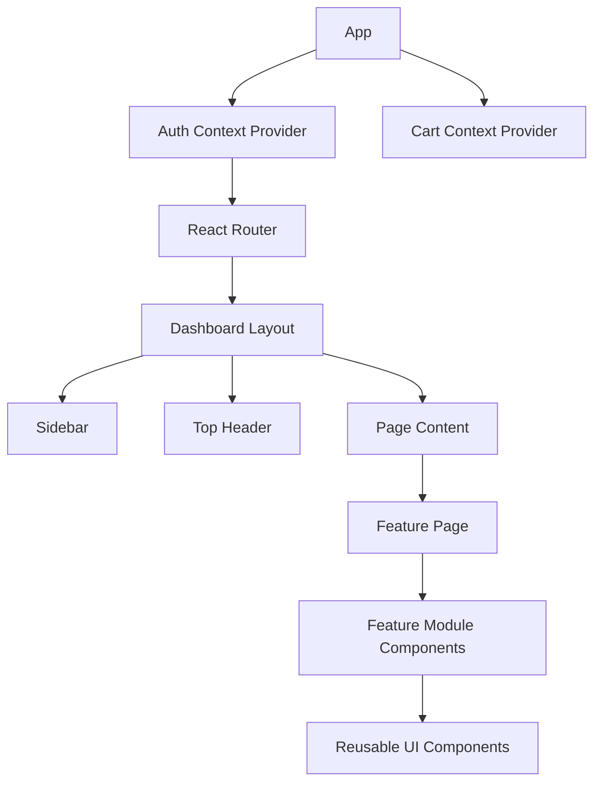

### Explanation

At the top level, `App` bootstraps global providers and routes. The dashboard layout wraps authenticated pages and keeps the sidebar, header, notifications, and main content area consistent. Each module page, such as Billing or Reports, is composed of smaller feature components and shared UI elements. This structure reduces duplication and keeps the interface predictable for cashiers, managers, and administrators.

---

## 3. Page Navigation Structure

Navigation is implemented using React Router and is controlled by authentication and role-based route guards.

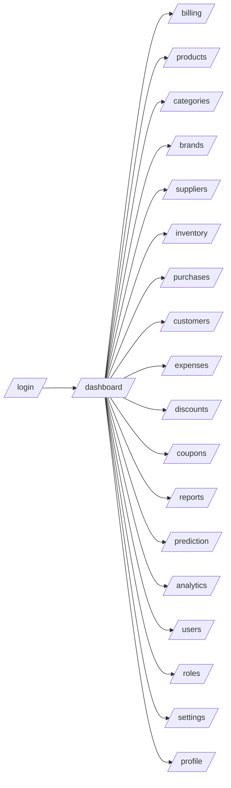

### Navigation principles

- The login page is public and handles authentication only.
- The dashboard is the default authenticated landing page.
- Sales Prediction and Analytics are visible to managers and administrators.
- User Management and Role Management are restricted to administrators.
- Billing is optimised for quick cashier access with the fewest possible clicks.

---

## 4. React Component Diagram

The React component diagram shows how the frontend modules are composed and reused across the system.

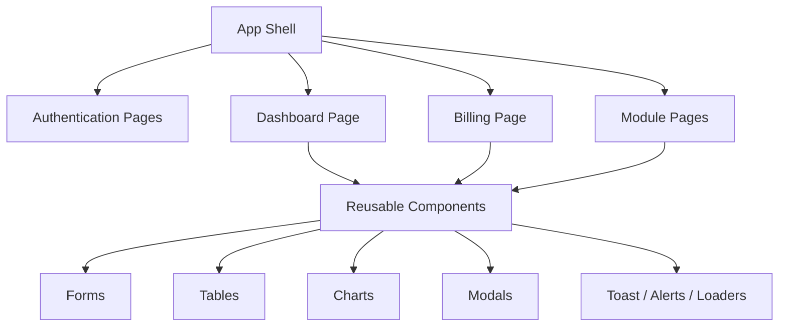

### Explanation

The application shell owns routing, layout, and global providers. Feature pages consume reusable UI primitives, while charts and feedback components are shared across Dashboard, Reports, and Prediction modules. This reduces repetition and supports a consistent design system throughout the POS interface.

---

## 5. State Management Architecture

The application uses a layered state approach. Global application state is stored in Context API, while local UI state remains inside component state. Server state is retrieved through Axios and managed at the page or feature level.

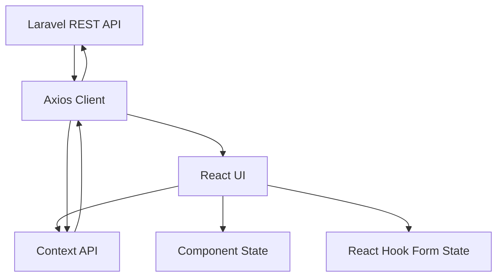

### Explanation

Context API is used for persistent global concerns such as authenticated user information, permissions, cart state, theme mode, and notification settings. Local component state is used for transient interactions such as modal visibility, search input, tab selection, and table filters. Form state is handled by React Hook Form to reduce re-renders and improve performance in complex forms.

---

## 6. API Communication Flow

The frontend communicates with the backend using Axios. All business operations are performed through the Laravel REST API, and machine learning predictions are obtained indirectly through Laravel, which communicates with the Flask API.

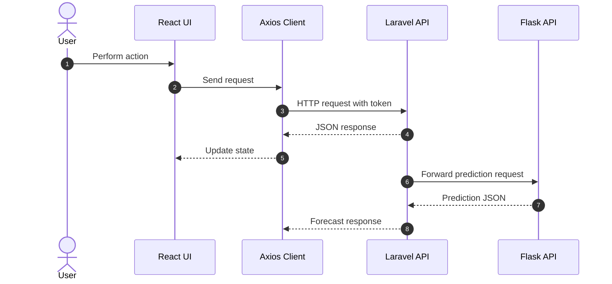

### Explanation

The React application never communicates directly with the Flask service. This preserves a clean separation between the transactional frontend and the predictive backend. Laravel acts as the single trusted API gateway for authentication, RBAC, auditing, and business validation.

---

## 7. Authentication Flow

Authentication is token-based and uses Laravel Sanctum on the backend. The frontend stores the authenticated session in a secure client-side state and uses the token for subsequent requests.

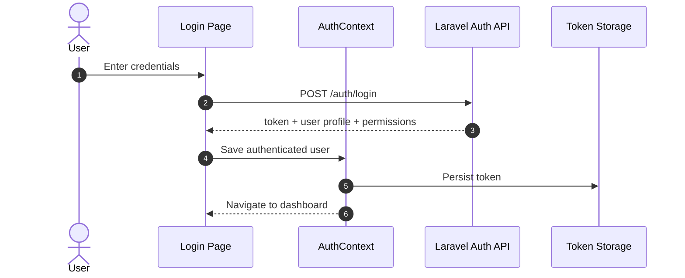

### Explanation

After a successful login, the backend returns the user profile, role, and access token. The frontend stores this information in an authentication context so that all protected pages can access the current session state. Token handling must be centralised to avoid duplication and to simplify logout, refresh, and permission checks.

---

## 8. Protected Route Flow

Protected routes prevent unauthorised access to sensitive POS modules. Route guards evaluate both authentication status and role permissions before rendering a page.

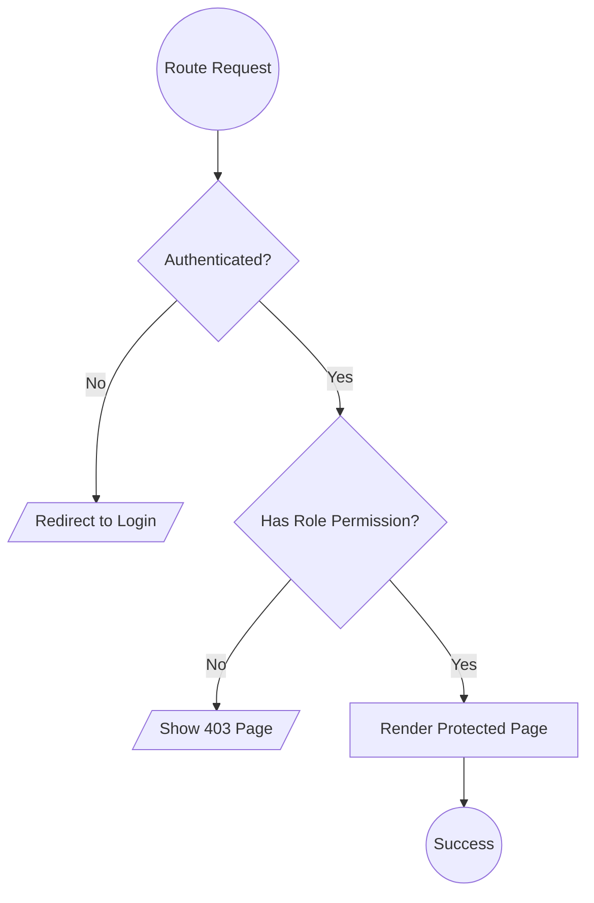

### Explanation

Cashiers should only see operational screens such as Billing, Customers, and basic Reports. Managers can access analytics, purchases, inventory, and prediction. Administrators receive the widest access, including user management, roles, and settings. This route strategy reduces the risk of accidental misuse and strengthens the internal security model.

---

## 9. UI Design Pattern

The UI follows a dashboard-oriented design system optimised for POS workflows.

### Design characteristics

- A persistent left sidebar for module navigation.
- A top header for search, notifications, profile access, and outlet context.
- Modular cards for KPIs and summaries.
- Data tables for transactional records.
- Drawer and modal patterns for fast editing without full page reloads.
- Responsive grids for dashboard and analytics screens.
- Fixed action areas in billing screens to support rapid cashier entry.

### Explanation

The interface is intentionally task-focused. POS billing requires speed, clarity, and minimal distraction, while analytics and reports require denser information presentation. For that reason, the visual language should combine compact operational layouts with clean dashboard components.

---

## 10. Reusable Components

Reusable components form the design system of the frontend. They ensure visual consistency and reduce implementation effort across modules.

### Core reusable components

- Button
- Input
- Select
- Checkbox
- RadioGroup
- DatePicker
- Modal
- Drawer
- Table
- TableToolbar
- Pagination
- Badge
- Card
- Tabs
- Breadcrumb
- Toast
- Alert
- Spinner
- EmptyState
- ConfirmDialog
- StatCard
- SearchBar
- ChartContainer
- FileUploader

### Explanation

Shared components should be implemented as controlled and configurable building blocks. For example, one table component can power Product Management, Supplier Management, Customer Management, and Reports with different column definitions and action sets. This avoids code duplication and improves maintainability.

---

## 11. Form Validation Flow

Forms are a critical part of POS operations because they are used for billing, product entry, purchase entry, login, coupon validation, and user management.

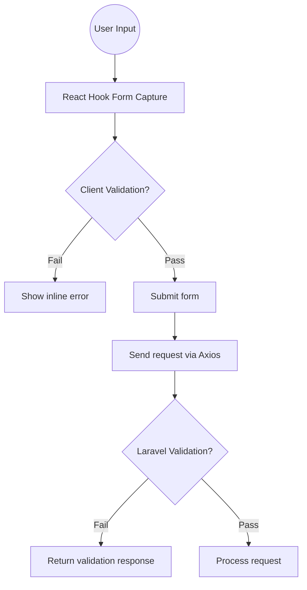

### Explanation

React Hook Form performs lightweight validation at the client side to deliver immediate feedback. However, all authoritative validation remains on the Laravel backend to ensure data integrity and protect against tampered requests. This dual-layer validation strategy is essential for financial and inventory transactions.

---

## 12. Dashboard Layout

The dashboard is the central command interface for the system. It presents business summaries, alerts, charts, and recent activity.

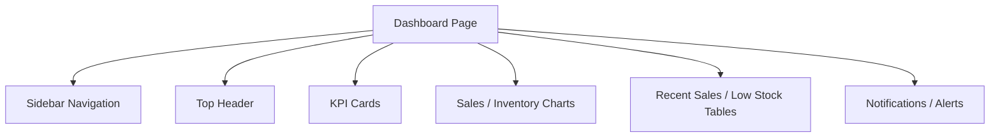

### Explanation

The dashboard should surface the most important operational metrics first: today’s sales, profit, low-stock items, pending purchases, and forecast summary. Managers and administrators use it for oversight, while cashiers can quickly confirm outlet status and recent activity.

---

## 13. Responsive Design Architecture

The frontend is built with Tailwind CSS to support responsive layouts across desktop, tablet, and mobile screens.

### Responsive strategy

- Mobile-first utility classes.
- Breakpoints for `sm`, `md`, `lg`, and `xl`.
- Collapsible sidebar for smaller screens.
- Responsive tables with horizontal scroll or card fallback.
- Stacked forms on small screens and multi-column layouts on larger screens.
- Flexible chart containers to avoid clipping.

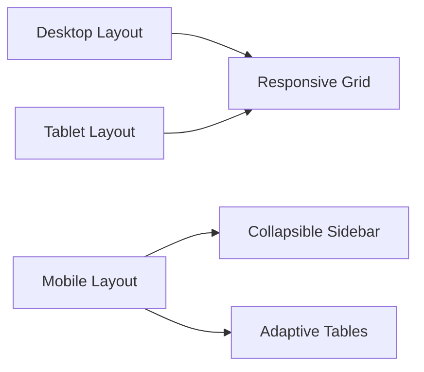

### Explanation

A POS system must function reliably on different screen sizes, especially in retail environments where managers may review reports on tablets and administrators may use desktop monitors. The layout should adapt without breaking operational flow.

---

## 14. Error Handling Flow

Error handling must be consistent across modules to support clarity and operational reliability.

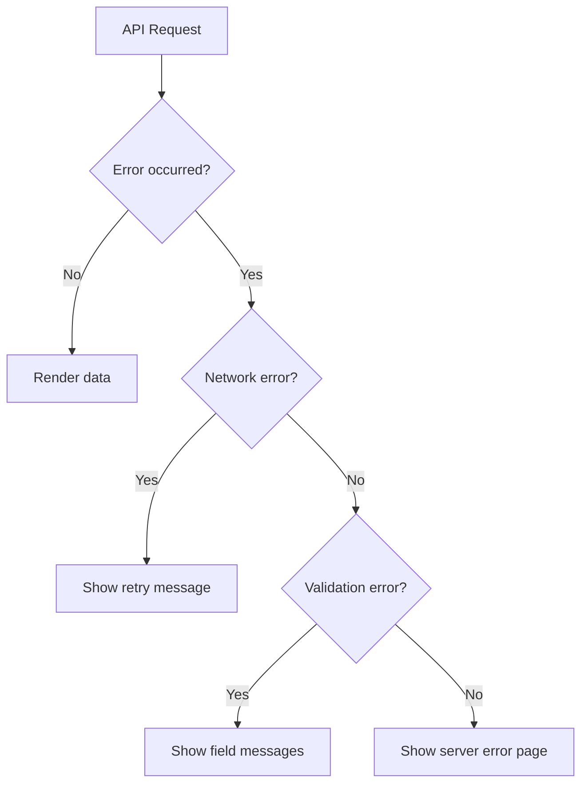

### Explanation

The frontend should distinguish between validation errors, network failures, authentication failures, and unexpected server errors. Validation messages should be shown inline on the relevant form fields, while system-level failures should be displayed through toast notifications or dedicated error views.

---

## 15. Loading State Management

Loading feedback is essential because the system contains data-heavy screens such as reports, analytics, prediction, and inventory views.

### Loading model

- Page skeletons for module loading.
- Button-level loading indicators for forms and actions.
- Table-level shimmer placeholders for report and search views.
- Chart-level loading overlays for prediction and analytics.

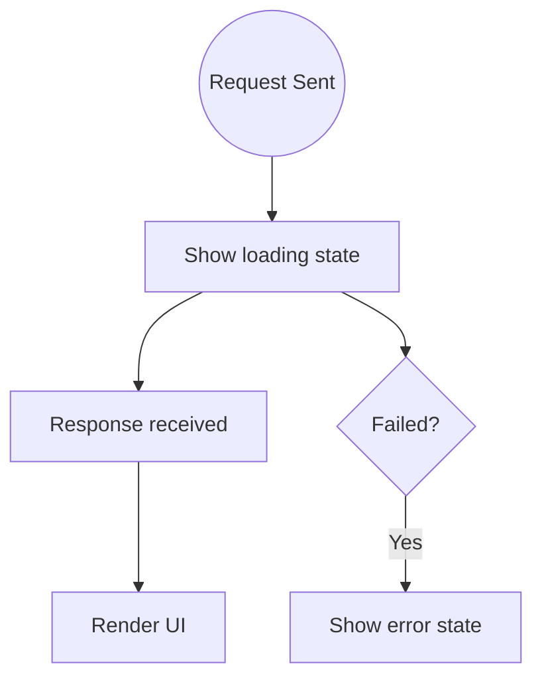

### Explanation

Loading states should be context-aware. A billing button should show a compact spinner, whereas the prediction module may require a full skeleton chart while waiting for forecast data. This improves usability and reduces uncertainty during processing.

---

## 16. Notification Architecture

Notifications communicate operational events such as sale completion, inventory warnings, successful saves, and prediction readiness.

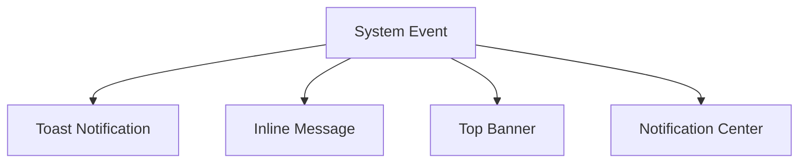

### Explanation

Different notification channels are used based on severity. Success feedback is best delivered through toast messages. Validation issues belong inline near the relevant controls. Warnings such as low stock or model retraining status should appear in a notification center or alert banner so they remain visible to managers.

---

## 17. Chart Integration

Charts are used in Dashboard, Reports, Sales Prediction, and Analytics Dashboard. The system may use either Chart.js or Recharts, but the integration approach remains the same.

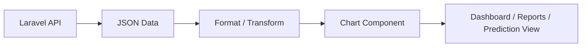

### Explanation

Backend responses should be normalised before rendering. For example, sales trends, category performance, forecast series, and inventory movement must be converted into chart-friendly label/value structures. Reusable chart wrappers should manage legends, tooltips, axis formatting, and empty states.

---

## 18. Folder Naming Convention

A consistent naming convention improves readability and makes the codebase easier to navigate.

### Recommended convention

- Use lowercase for folders and files.
- Use `camelCase` for utility functions and hooks.
- Use `PascalCase` for React components.
- Use suffixes such as `Page`, `Form`, `Table`, `Card`, `Modal`, and `Layout`.
- Keep service files descriptive, such as `salesService.ts` or `predictionService.ts`.
- Keep context files descriptive, such as `AuthContext.tsx` and `CartContext.tsx`.

### Example structure

```text
features/
  billing/
    components/
      BillingCart.tsx
      PaymentForm.tsx
      ReceiptModal.tsx
    pages/
      BillingPage.tsx
    services/
      billingService.ts
    hooks/
      useBilling.ts
```

---

## Frontend Architecture Summary

The proposed frontend architecture is a feature-based React application built on a scalable dashboard pattern. React Router controls navigation, Context API manages global client state, React Hook Form handles validation, and Axios provides a clean API boundary to the Laravel backend. Tailwind CSS ensures responsive design, while Chart.js or Recharts supports rich visualisation of sales and prediction data.

This architecture is suitable for a university-level final year project because it clearly separates concerns, supports modular development, and provides a professional structure for implementing a production-ready Smart POS interface.
