# Chapter 5 — System Design

## Smart POS System with Sales Prediction in Sri Lanka

**Project Type:** BSc (Hons) Software Engineering — Final Year Research Project
**Document:** System Design (Chapter 5)
**Architecture Style:** Layered, Modular Monolith with Microservice-style ML Component
**Author:** Senior Software Architect

---

## Table of Contents

1. Overall System Architecture
2. High Level Architecture Diagram
3. Component Diagram
4. Deployment Diagram
5. Database Design
6. ER Diagram
7. Class Diagram
8. Sequence Diagrams
9. Activity Diagrams
10. API Design
11. Machine Learning System Design
12. Security Architecture
13. Design Patterns
14. Scalability Design
15. Non Functional Architecture
16. Technology Justification
17. Module Interaction
18. Data Flow
19. Conclusion

---

## 1. Overall System Architecture

### 1.1 Architecture Explanation

The Smart POS System with Sales Prediction is designed as a **hybrid architecture** that combines a **Layered Modular Monolith** (Laravel + React) with a **dedicated Machine Learning Microservice** (Python Flask). This hybrid approach was selected because the transactional POS workload demands strong consistency, referential integrity, and rapid CRUD performance — best served by a monolithic MVC application — while the prediction workload requires a Python-native data science ecosystem (Pandas, NumPy, Prophet, XGBoost) that is impractical to embed inside a PHP runtime.

The system is decomposed into **five logical layers**, each with a single, well-defined responsibility. Communication between layers is strictly top-down: the Presentation Layer never touches the Data Layer directly; all requests must pass through the Business Layer and the API Layer. The only cross-cutting exception is the Machine Learning Layer, which is invoked asynchronously by the Business Layer through an HTTP contract (the Flask Prediction API).

This separation ensures:

- **Separation of Concerns** — UI, business rules, persistence, and inference are isolated.
- **Testability** — Each layer can be unit-tested in isolation using mocks/stubs.
- **Replaceability** — The Flask API can be replaced with another provider without touching the Laravel core.
- **Scalability** — The ML service can be scaled independently of the POS backend.
- **Maintainability** — Modules can evolve without cascading changes.

### 1.2 Layered Architecture

#### 5.1.1 Presentation Layer

The Presentation Layer is the **client tier**, implemented as a Single Page Application (SPA) using **React.js 18** bundled with **Vite** and styled with **Tailwind CSS**. This layer is responsible for:

- Rendering the user interface for all 19 functional modules.
- Capturing user input (cashier transactions, manager configurations, administrator user-management).
- Calling the Laravel REST API through `fetch`/`axios` with Sanctum bearer tokens.
- Managing client-side state (cart, filters, pagination) using React Context and hooks.
- Displaying prediction visualizations (charts) using a charting library (e.g., Recharts).

The Presentation Layer is **stateless** — it holds no business truth. All persistent state lives in MySQL via the Laravel backend. This allows horizontal scaling of the frontend through CDN deployment and supports offline-tolerant POS sessions through local caching of the active cart.

#### 5.1.2 Business Layer

The Business Layer is the **core rule engine**, implemented inside Laravel 12 using the **Service Layer + Repository Pattern**. It contains:

- **Services** — `BillingService`, `InventoryService`, `DiscountService`, `CouponService`, `PredictionOrchestrator`, `ReportService`, `AuditService`.
- **Domain rules** — Tax computation, multi-item discount resolution, coupon validation, stock deduction logic, profit calculation.
- **Workflow orchestration** — Coordinates between repositories, dispatches events (e.g., `SaleCompleted`, `StockLow`), and invokes the ML Prediction API.

The Business Layer is **framework-agnostic in intent**: services depend on repository interfaces, not on Eloquent models directly, allowing the persistence backend to be swapped if required.

#### 5.1.3 API Layer

The API Layer is the **communication boundary**, implemented as Laravel HTTP Controllers and Form Requests. It is responsible for:

- Exposing REST endpoints under `/api/v1/*`.
- Authenticating requests via **Laravel Sanctum** bearer tokens.
- Authorizing requests via **RBAC middleware** (`role:admin|manager|cashier`).
- Validating input through Form Request classes.
- Transforming responses through API Resources (JSON serialization).
- Throttling requests via Laravel's `throttle` middleware.

The API Layer is **thin** — it delegates all logic to the Business Layer. Controllers never query the database directly.

#### 5.1.4 Data Layer

The Data Layer is the **persistence tier**, implemented with **MySQL 8.0** accessed through Laravel's Eloquent ORM and the Repository Pattern. It is responsible for:

- Storing all transactional data (sales, purchases, inventory, users, audit logs).
- Enforcing referential integrity through foreign keys.
- Applying database-level indexes for high-frequency queries.
- Executing transactions for atomic operations (e.g., sale + inventory deduction).
- Materializing prediction results cached from the ML service.

Migrations are versioned and reversible. The Data Layer exposes only Repository interfaces to the Business Layer, ensuring the ORM is not leaked into services.

#### 5.1.5 Machine Learning Layer

The Machine Learning Layer is a **standalone Python service** exposed through a **Flask REST API**. It is responsible for:

- Ingesting historical sales data exported from MySQL.
- Cleaning and preprocessing data with **Pandas** and **NumPy**.
- Engineering features (lag features, rolling means, day-of-week, holiday flags, festival indicators for Sri Lankan calendar).
- Training two candidate models: **Prophet** (additive, seasonality-aware) and **XGBoost** (gradient-boosted trees).
- Evaluating models on **RMSE** and **MAE**.
- Selecting the best-performing model per prediction horizon (daily/weekly/monthly).
- Serving predictions through `/predict`, `/train`, and `/evaluate` endpoints.
- Returning results as JSON consumed by the Laravel Business Layer and visualized by the React frontend.

The ML Layer is **stateless at inference time** — trained models are serialized to disk (`joblib`/`pickle`) and loaded into memory at Flask startup. Retraining is triggered on a schedule (e.g., nightly) or on demand by an Administrator.

### 1.3 Data Flow

The end-to-end data flow follows a strict request-response pipeline:

1. **User Action** — A user (Cashier, Manager, or Administrator) interacts with the React SPA. The action triggers an HTTP request to the Laravel API.
2. **Authentication & Authorization** — Sanctum middleware validates the bearer token; RBAC middleware verifies the user's role has permission for the requested resource.
3. **Validation** — A Form Request validates payload structure and business constraints.
4. **Controller Delegation** — The Controller delegates to the appropriate Service in the Business Layer.
5. **Business Execution** — The Service orchestrates repositories, applies domain rules, and (if needed) calls the Flask Prediction API.
6. **Persistence** — Repositories translate domain operations into Eloquent queries against MySQL. Database transactions ensure atomicity for multi-step operations (e.g., sale + stock deduction + audit log).
7. **Event Dispatch** — Domain events (`SaleCompleted`, `StockLow`, `CouponRedeemed`) are dispatched to observers for side-effects (audit logging, low-stock alerts).
8. **Response** — The API Resource serializes the result to JSON and returns it to the React client.
9. **Rendering** — React updates the UI; for prediction responses, charts are rendered to visualize forecasted sales.

This pipeline guarantees that every mutation is audited, every sale is atomic, and every prediction request is decoupled from the transactional path.

---

## 2. High Level Architecture Diagram

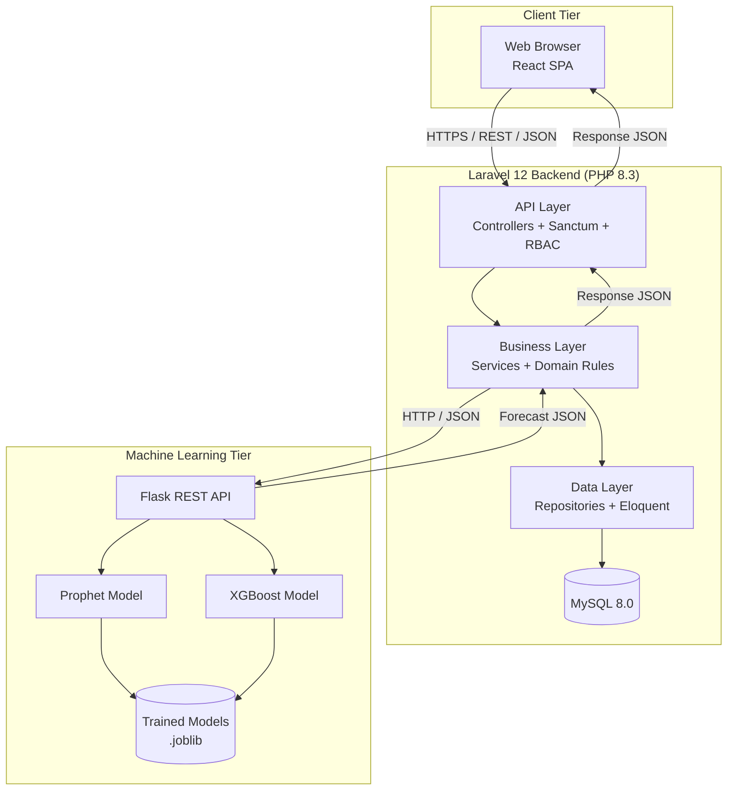

**Legend:** Solid arrows denote synchronous HTTP/REST calls. Database cylinders represent persistent storage. The Laravel backend and the Flask ML service are independently deployable and independently scalable.

---

## 3. Component Diagram

The component diagram models every functional module as a UML component with provided and required interfaces. Components communicate through the central `BillingService` and the shared `AuditService`.

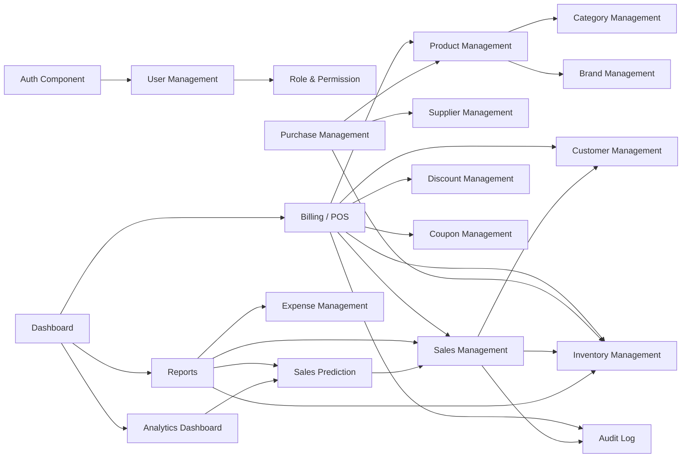

Each component exposes a REST interface (described in Section 10) and consumes shared services (`AuditService`, `AuthService`, `PredictionOrchestrator`) through dependency injection.

---

## 4. Deployment Diagram

The deployment diagram models the physical runtime nodes, the artifacts deployed on each, and the communication protocols between them.

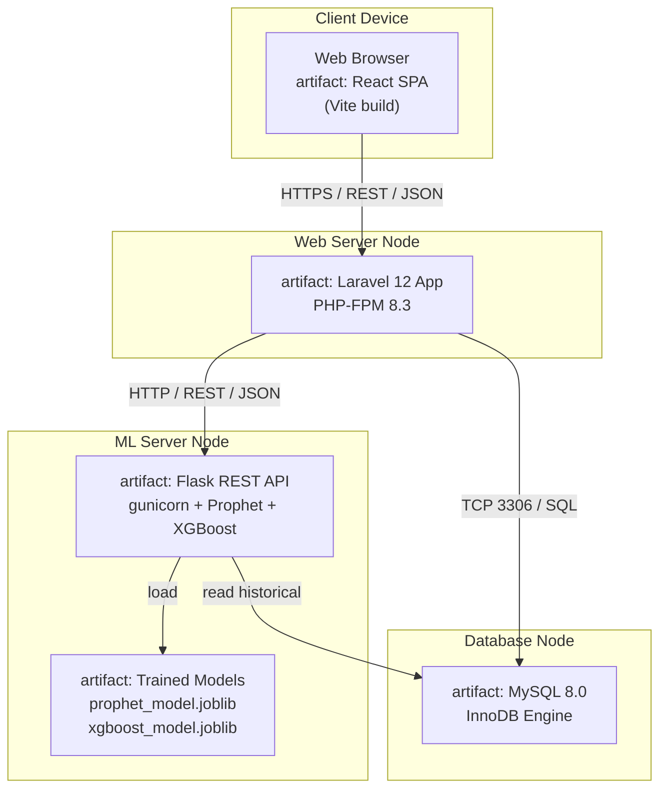

**Deployment Notes:**

- The React SPA is built statically by Vite and served by Nginx as a CDN-cacheable asset bundle.
- Laravel runs behind PHP-FPM; Sanctum tokens are stored in the `personal_access_tokens` table in MySQL.
- The Flask service runs behind **gunicorn** with multiple workers; it reads historical sales from MySQL (read-only) and serves predictions to Laravel.
- Trained model artifacts are persisted to disk on the ML node and versioned by training timestamp.
- In production, the ML node can be containerized (Docker) and scaled horizontally behind a load balancer.

---

## 5. Database Design

The database is normalized to **Third Normal Form (3NF)** with selective denormalization only where read performance justifies it (e.g., `sale_items.unit_price_snapshot` to preserve historical pricing). All tables use **BIGINT UNSIGNED AUTO_INCREMENT** primary keys, **UTF8MB4** charset, and **InnoDB** engine for transactional integrity.

### 5.1 Table Catalogue

#### 5.1.1 `users`
| Column | Type | Constraints |
|---|---|---|
| id | BIGINT UNSIGNED | PK, AUTO_INCREMENT |
| name | VARCHAR(150) | NOT NULL |
| email | VARCHAR(150) | NOT NULL, UNIQUE |
| email_verified_at | TIMESTAMP | NULL |
| password | VARCHAR(255) | NOT NULL (bcrypt hash) |
| role_id | BIGINT UNSIGNED | FK → roles.id |
| is_active | TINYINT(1) | DEFAULT 1 |
| last_login_at | TIMESTAMP | NULL |
| created_at / updated_at | TIMESTAMP | |

#### 5.1.2 `roles`
| Column | Type | Constraints |
|---|---|---|
| id | BIGINT UNSIGNED | PK |
| name | VARCHAR(50) | NOT NULL, UNIQUE (Administrator / Manager / Cashier) |
| slug | VARCHAR(50) | NOT NULL, UNIQUE |
| created_at / updated_at | TIMESTAMP | |

#### 5.1.3 `permissions`
| Column | Type | Constraints |
|---|---|---|
| id | BIGINT UNSIGNED | PK |
| name | VARCHAR(100) | NOT NULL, UNIQUE |
| slug | VARCHAR(100) | NOT NULL, UNIQUE |
| module | VARCHAR(50) | NOT NULL |

#### 5.1.4 `role_permissions` (pivot)
| Column | Type | Constraints |
|---|---|---|
| role_id | BIGINT UNSIGNED | FK → roles.id |
| permission_id | BIGINT UNSIGNED | FK → permissions.id |
| PK | composite | (role_id, permission_id) |

#### 5.1.5 `categories`
| Column | Type | Constraints |
|---|---|---|
| id | BIGINT UNSIGNED | PK |
| name | VARCHAR(150) | NOT NULL |
| description | TEXT | NULL |
| is_active | TINYINT(1) | DEFAULT 1 |
| created_at / updated_at | TIMESTAMP | |

#### 5.1.6 `brands`
| Column | Type | Constraints |
|---|---|---|
| id | BIGINT UNSIGNED | PK |
| name | VARCHAR(150) | NOT NULL |
| description | TEXT | NULL |
| created_at / updated_at | TIMESTAMP | |

#### 5.1.7 `suppliers`
| Column | Type | Constraints |
|---|---|---|
| id | BIGINT UNSIGNED | PK |
| name | VARCHAR(150) | NOT NULL |
| contact_person | VARCHAR(150) | NULL |
| phone | VARCHAR(20) | NULL |
| email | VARCHAR(150) | NULL |
| address | TEXT | NULL |
| created_at / updated_at | TIMESTAMP | |

#### 5.1.8 `products`
| Column | Type | Constraints |
|---|---|---|
| id | BIGINT UNSIGNED | PK |
| name | VARCHAR(200) | NOT NULL |
| sku | VARCHAR(50) | NOT NULL, UNIQUE |
| barcode | VARCHAR(50) | NULL, UNIQUE |
| category_id | BIGINT UNSIGNED | FK → categories.id |
| brand_id | BIGINT UNSIGNED | FK → brands.id |
| supplier_id | BIGINT UNSIGNED | FK → suppliers.id, NULL |
| cost_price | DECIMAL(12,2) | NOT NULL |
| selling_price | DECIMAL(12,2) | NOT NULL |
| tax_rate | DECIMAL(5,2) | DEFAULT 0.00 |
| unit | VARCHAR(20) | DEFAULT 'pcs' |
| image_path | VARCHAR(255) | NULL |
| is_active | TINYINT(1) | DEFAULT 1 |
| created_at / updated_at | TIMESTAMP | |

#### 5.1.9 `inventory`
| Column | Type | Constraints |
|---|---|---|
| id | BIGINT UNSIGNED | PK |
| product_id | BIGINT UNSIGNED | FK → products.id, UNIQUE |
| quantity | INT | NOT NULL, DEFAULT 0 |
| reorder_level | INT | NOT NULL, DEFAULT 10 |
| last_restocked_at | TIMESTAMP | NULL |
| created_at / updated_at | TIMESTAMP | |

#### 5.1.10 `customers`
| Column | Type | Constraints |
|---|---|---|
| id | BIGINT UNSIGNED | PK |
| name | VARCHAR(150) | NOT NULL |
| phone | VARCHAR(20) | NULL |
| email | VARCHAR(150) | NULL |
| address | TEXT | NULL |
| loyalty_points | INT | DEFAULT 0 |
| created_at / updated_at | TIMESTAMP | |

#### 5.1.11 `sales`
| Column | Type | Constraints |
|---|---|---|
| id | BIGINT UNSIGNED | PK |
| invoice_no | VARCHAR(30) | NOT NULL, UNIQUE |
| customer_id | BIGINT UNSIGNED | FK → customers.id, NULL |
| cashier_id | BIGINT UNSIGNED | FK → users.id |
| subtotal | DECIMAL(14,2) | NOT NULL |
| discount_amount | DECIMAL(14,2) | DEFAULT 0.00 |
| tax_amount | DECIMAL(14,2) | DEFAULT 0.00 |
| total | DECIMAL(14,2) | NOT NULL |
| paid_amount | DECIMAL(14,2) | NOT NULL |
| change_amount | DECIMAL(14,2) | DEFAULT 0.00 |
| payment_method | ENUM('cash','card','mobile') | NOT NULL |
| coupon_id | BIGINT UNSIGNED | FK → coupons.id, NULL |
| sale_date | TIMESTAMP | NOT NULL, DEFAULT CURRENT_TIMESTAMP |
| created_at / updated_at | TIMESTAMP | |

#### 5.1.12 `sale_items`
| Column | Type | Constraints |
|---|---|---|
| id | BIGINT UNSIGNED | PK |
| sale_id | BIGINT UNSIGNED | FK → sales.id ON DELETE CASCADE |
| product_id | BIGINT UNSIGNED | FK → products.id |
| quantity | INT | NOT NULL |
| unit_price_snapshot | DECIMAL(12,2) | NOT NULL (historical price) |
| unit_cost_snapshot | DECIMAL(12,2) | NOT NULL (for profit calc) |
| line_total | DECIMAL(14,2) | NOT NULL |
| created_at | TIMESTAMP | |

#### 5.1.13 `purchases`
| Column | Type | Constraints |
|---|---|---|
| id | BIGINT UNSIGNED | PK |
| reference_no | VARCHAR(30) | NOT NULL, UNIQUE |
| supplier_id | BIGINT UNSIGNED | FK → suppliers.id |
| total_amount | DECIMAL(14,2) | NOT NULL |
| purchase_date | TIMESTAMP | NOT NULL |
| status | ENUM('pending','received','cancelled') | DEFAULT 'pending' |
| created_by | BIGINT UNSIGNED | FK → users.id |
| created_at / updated_at | TIMESTAMP | |

#### 5.1.14 `purchase_items`
| Column | Type | Constraints |
|---|---|---|
| id | BIGINT UNSIGNED | PK |
| purchase_id | BIGINT UNSIGNED | FK → purchases.id ON DELETE CASCADE |
| product_id | BIGINT UNSIGNED | FK → products.id |
| quantity | INT | NOT NULL |
| unit_cost | DECIMAL(12,2) | NOT NULL |
| line_total | DECIMAL(14,2) | NOT NULL |

#### 5.1.15 `expenses`
| Column | Type | Constraints |
|---|---|---|
| id | BIGINT UNSIGNED | PK |
| category | VARCHAR(100) | NOT NULL |
| amount | DECIMAL(14,2) | NOT NULL |
| expense_date | TIMESTAMP | NOT NULL |
| description | TEXT | NULL |
| created_by | BIGINT UNSIGNED | FK → users.id |
| created_at / updated_at | TIMESTAMP | |

#### 5.1.16 `discounts`
| Column | Type | Constraints |
|---|---|---|
| id | BIGINT UNSIGNED | PK |
| name | VARCHAR(150) | NOT NULL |
| type | ENUM('percentage','fixed') | NOT NULL |
| value | DECIMAL(10,2) | NOT NULL |
| product_id | BIGINT UNSIGNED | FK → products.id, NULL |
| category_id | BIGINT UNSIGNED | FK → categories.id, NULL |
| starts_at | TIMESTAMP | NOT NULL |
| ends_at | TIMESTAMP | NOT NULL |
| is_active | TINYINT(1) | DEFAULT 1 |

#### 5.1.17 `coupons`
| Column | Type | Constraints |
|---|---|---|
| id | BIGINT UNSIGNED | PK |
| code | VARCHAR(30) | NOT NULL, UNIQUE |
| type | ENUM('percentage','fixed') | NOT NULL |
| value | DECIMAL(10,2) | NOT NULL |
| min_order_amount | DECIMAL(14,2) | DEFAULT 0.00 |
| max_uses | INT | NULL |
| used_count | INT | DEFAULT 0 |
| starts_at | TIMESTAMP | NOT NULL |
| ends_at | TIMESTAMP | NOT NULL |
| is_active | TINYINT(1) | DEFAULT 1 |

#### 5.1.18 `audit_logs`
| Column | Type | Constraints |
|---|---|---|
| id | BIGINT UNSIGNED | PK |
| user_id | BIGINT UNSIGNED | FK → users.id, NULL |
| action | VARCHAR(50) | NOT NULL (CREATE/UPDATE/DELETE/LOGIN) |
| module | VARCHAR(50) | NOT NULL |
| entity_type | VARCHAR(50) | NULL |
| entity_id | BIGINT UNSIGNED | NULL |
| old_values | JSON | NULL |
| new_values | JSON | NULL |
| ip_address | VARCHAR(45) | NULL |
| user_agent | VARCHAR(255) | NULL |
| created_at | TIMESTAMP | NOT NULL, DEFAULT CURRENT_TIMESTAMP |

#### 5.1.19 `personal_access_tokens` (Sanctum)
| Column | Type | Constraints |
|---|---|---|
| id | BIGINT UNSIGNED | PK |
| tokenable_type | VARCHAR(255) | NOT NULL |
| tokenable_id | BIGINT UNSIGNED | NOT NULL |
| name | VARCHAR(255) | NOT NULL |
| token | VARCHAR(64) | NOT NULL, UNIQUE (hash) |
| abilities | TEXT | NULL |
| last_used_at | TIMESTAMP | NULL |
| created_at / updated_at | TIMESTAMP | |

#### 5.1.20 `predictions`
| Column | Type | Constraints |
|---|---|---|
| id | BIGINT UNSIGNED | PK |
| horizon | ENUM('daily','weekly','monthly') | NOT NULL |
| target_date | DATE | NOT NULL |
| predicted_value | DECIMAL(14,2) | NOT NULL |
| model_used | ENUM('prophet','xgboost') | NOT NULL |
| rmse | DECIMAL(10,4) | NULL |
| mae | DECIMAL(10,4) | NULL |
| payload | JSON | NULL (full forecast series) |
| generated_at | TIMESTAMP | NOT NULL |

### 5.2 Normalization Justification

- **1NF** — All columns are atomic; no repeating groups.
- **2NF** — All non-key attributes depend on the whole primary key (composite keys only on pivots).
- **3NF** — No transitive dependencies; e.g., `sale_items` stores `unit_price_snapshot` to avoid dependency on the mutable `products.selling_price`.
- **Denormalization** — `sale_items.unit_cost_snapshot` is intentionally denormalized to preserve historical profit accuracy even when supplier costs change.

### 5.3 Indexing Strategy

- `products.sku`, `products.barcode` — UNIQUE indexes for fast lookup.
- `sale_items.product_id`, `sale_items.sale_id` — B-tree indexes for join performance.
- `sales.sale_date`, `sales.invoice_no` — indexes for reporting and receipt lookup.
- `audit_logs(user_id, created_at)` — composite index for audit queries.
- `predictions(horizon, target_date)` — composite index for forecast retrieval.

---

## 6. ER Diagram

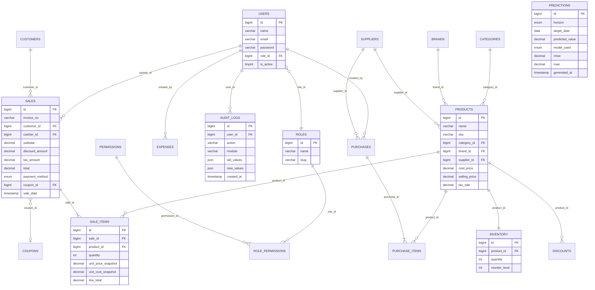

---

## 7. Class Diagram

The class diagram models the principal domain classes of the Laravel application, including their attributes, methods, and relationships. Service and Repository classes are included to reflect the architectural patterns described in Section 13.

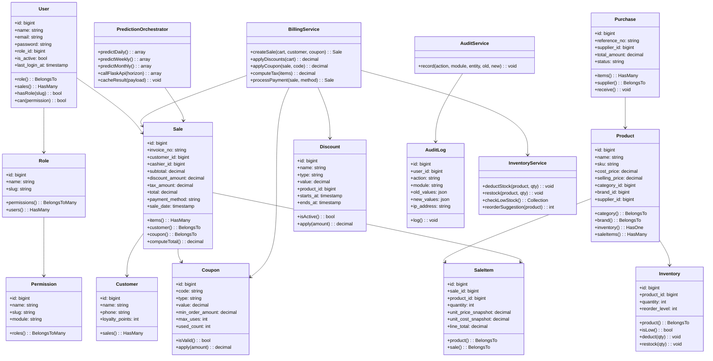

---

## 8. Sequence Diagrams

### 8.1 Login Sequence

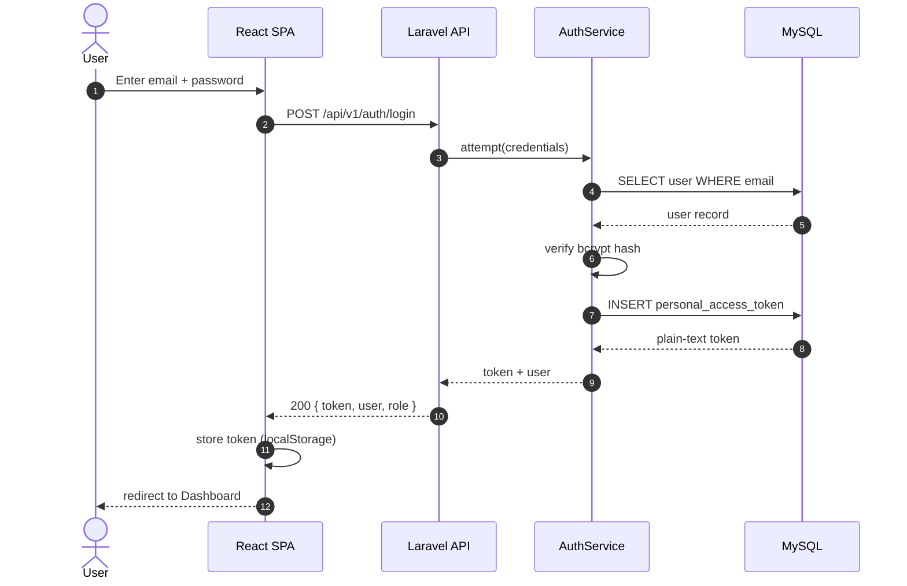

### 8.2 Billing Sequence

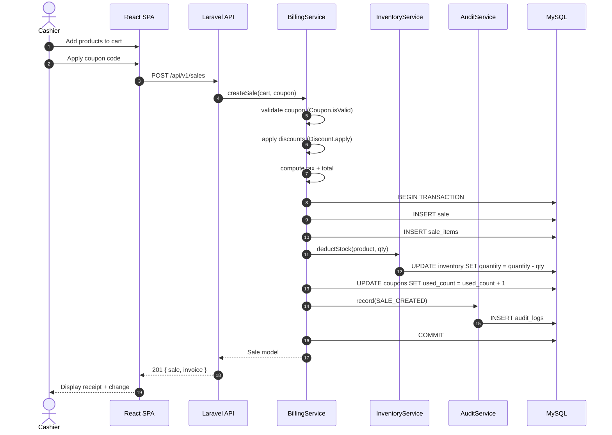

### 8.3 Sales Prediction Sequence

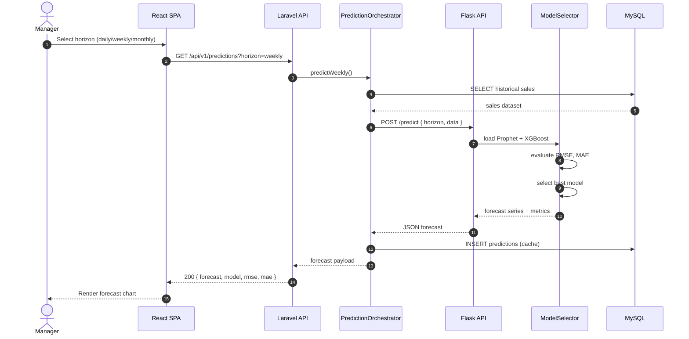

### 8.4 Inventory Update Sequence

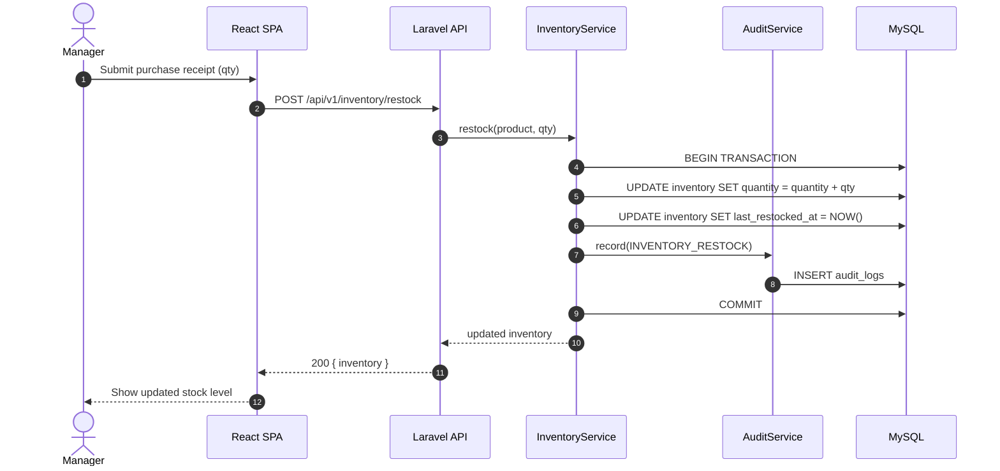

---

## 9. Activity Diagrams

### 9.1 Billing Process

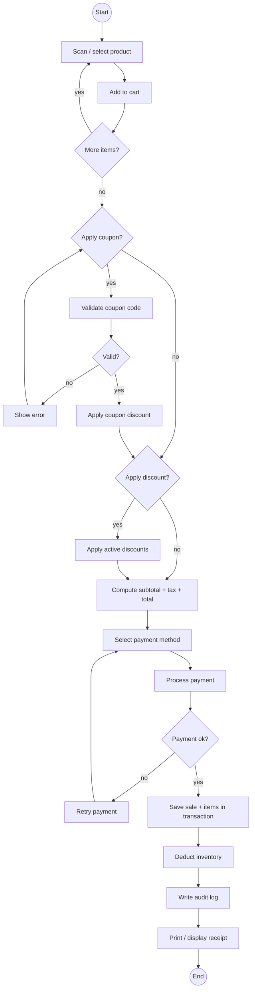

### 9.2 Prediction Process

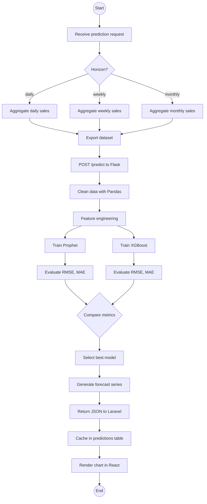

### 9.3 Inventory Process

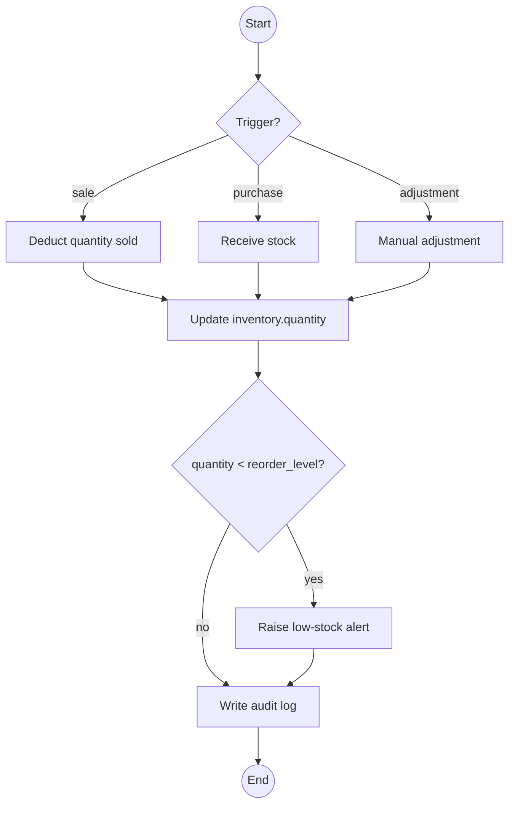

---

## 10. API Design

All endpoints are prefixed `/api/v1`. Authentication uses `Authorization: Bearer <sanctum-token>`. Required roles are noted in the **Auth** column: **A** = Administrator, **M** = Manager, **C** = Cashier, **P** = Public.

### 10.1 Authentication

| Method | URL | Description | Auth |
|---|---|---|---|
| POST | /auth/login | Login, returns Sanctum token | P |
| POST | /auth/logout | Invalidate current token | A,M,C |
| GET | /auth/me | Return current user + role | A,M,C |
| POST | /auth/refresh | Rotate token | A,M,C |

### 10.2 Dashboard & Analytics

| Method | URL | Description | Auth |
|---|---|---|---|
| GET | /dashboard/summary | KPIs: today's sales, low stock, top products | A,M |
| GET | /analytics/sales-trend | Sales trend over time range | A,M |
| GET | /analytics/top-products | Top-selling products | A,M |

### 10.3 Billing / POS

| Method | URL | Description | Auth |
|---|---|---|---|
| POST | /sales | Create a new sale (cart + coupon + payment) | A,M,C |
| GET | /sales | List sales (paginated, filterable) | A,M |
| GET | /sales/{id} | Sale detail with items | A,M |
| POST | /sales/{id}/refund | Refund a sale | A,M |
| GET | /sales/invoice/{invoice_no} | Fetch sale by invoice number | A,M,C |

### 10.4 Product Management

| Method | URL | Description | Auth |
|---|---|---|---|
| GET | /products | List products (paginated) | A,M,C |
| POST | /products | Create product | A,M |
| GET | /products/{id} | Show product | A,M,C |
| PUT | /products/{id} | Update product | A,M |
| DELETE | /products/{id} | Soft-delete product | A |
| GET | /products/search?q= | Quick search by SKU/barcode/name | A,M,C |

### 10.5 Category Management

| Method | URL | Description | Auth |
|---|---|---|---|
| GET | /categories | List categories | A,M,C |
| POST | /categories | Create category | A,M |
| PUT | /categories/{id} | Update category | A,M |
| DELETE | /categories/{id} | Delete category | A |

### 10.6 Brand Management

| Method | URL | Description | Auth |
|---|---|---|---|
| GET | /brands | List brands | A,M,C |
| POST | /brands | Create brand | A,M |
| PUT | /brands/{id} | Update brand | A,M |
| DELETE | /brands/{id} | Delete brand | A |

### 10.7 Supplier Management

| Method | URL | Description | Auth |
|---|---|---|---|
| GET | /suppliers | List suppliers | A,M |
| POST | /suppliers | Create supplier | A,M |
| GET | /suppliers/{id} | Show supplier | A,M |
| PUT | /suppliers/{id} | Update supplier | A,M |
| DELETE | /suppliers/{id} | Delete supplier | A |

### 10.8 Inventory Management

| Method | URL | Description | Auth |
|---|---|---|---|
| GET | /inventory | List inventory with stock levels | A,M |
| GET | /inventory/low-stock | List items below reorder level | A,M |
| POST | /inventory/restock | Restock a product | A,M |
| PUT | /inventory/{id} | Adjust stock / reorder level | A,M |

### 10.9 Purchase Management

| Method | URL | Description | Auth |
|---|---|---|---|
| GET | /purchases | List purchases | A,M |
| POST | /purchases | Create purchase order | A,M |
| GET | /purchases/{id} | Show purchase with items | A,M |
| PUT | /purchases/{id}/receive | Mark purchase as received (updates stock) | A,M |
| DELETE | /purchases/{id} | Cancel purchase | A |

### 10.10 Sales Management

| Method | URL | Description | Auth |
|---|---|---|---|
| GET | /sales/report/daily | Daily sales report | A,M |
| GET | /sales/report/monthly | Monthly sales report | A,M |
| GET | /sales/report/profit | Profit report | A,M |

### 10.11 Customer Management

| Method | URL | Description | Auth |
|---|---|---|---|
| GET | /customers | List customers | A,M,C |
| POST | /customers | Create customer | A,M,C |
| GET | /customers/{id} | Show customer with purchase history | A,M,C |
| PUT | /customers/{id} | Update customer | A,M |
| DELETE | /customers/{id} | Delete customer | A |

### 10.12 Expense Management

| Method | URL | Description | Auth |
|---|---|---|---|
| GET | /expenses | List expenses | A,M |
| POST | /expenses | Create expense | A,M |
| PUT | /expenses/{id} | Update expense | A,M |
| DELETE | /expenses/{id} | Delete expense | A |

### 10.13 Discount Management

| Method | URL | Description | Auth |
|---|---|---|---|
| GET | /discounts | List discounts | A,M |
| POST | /discounts | Create discount | A,M |
| PUT | /discounts/{id} | Update discount | A,M |
| DELETE | /discounts/{id} | Delete discount | A |

### 10.14 Coupon Management

| Method | URL | Description | Auth |
|---|---|---|---|
| GET | /coupons | List coupons | A,M |
| POST | /coupons | Create coupon | A,M |
| PUT | /coupons/{id} | Update coupon | A,M |
| DELETE | /coupons/{id} | Delete coupon | A |
| POST | /coupons/validate | Validate a coupon code against an amount | A,M,C |

### 10.15 User Management

| Method | URL | Description | Auth |
|---|---|---|---|
| GET | /users | List users | A |
| POST | /users | Create user | A |
| PUT | /users/{id} | Update user | A |
| DELETE | /users/{id} | Deactivate user | A |

### 10.16 Role & Permission Management

| Method | URL | Description | Auth |
|---|---|---|---|
| GET | /roles | List roles | A |
| PUT | /roles/{id}/permissions | Sync role permissions | A |
| GET | /permissions | List all permissions | A |

### 10.17 Audit Log

| Method | URL | Description | Auth |
|---|---|---|---|
| GET | /audit-logs | List audit logs (paginated, filterable) | A |
| GET | /audit-logs/{id} | Show audit log detail | A |

### 10.18 Reports

| Method | URL | Description | Auth |
|---|---|---|---|
| GET | /reports/daily-sales | Daily sales report | A,M |
| GET | /reports/monthly-sales | Monthly sales report | A,M |
| GET | /reports/inventory | Inventory report | A,M |
| GET | /reports/profit | Profit report | A,M |
| GET | /reports/expenses | Expense report | A,M |
| GET | /reports/forecast | Forecast report (cached predictions) | A,M |
| GET | /reports/export | Export report (PDF/CSV) | A,M |

### 10.19 Sales Prediction

| Method | URL | Description | Auth |
|---|---|---|---|
| GET | /predictions?horizon=daily | Get daily forecast | A,M |
| GET | /predictions?horizon=weekly | Get weekly forecast | A,M |
| GET | /predictions?horizon=monthly | Get monthly forecast | A,M |
| POST | /predictions/train | Trigger model retraining | A |
| GET | /predictions/metrics | Return latest RMSE / MAE per model | A,M |

---

## 11. Machine Learning System Design

### 11.1 Data Collection

Historical sales data is the primary input to the prediction pipeline. The Flask service issues a read-only SQL query against MySQL to extract:

- `sale_date` (timestamp, truncated to day)
- `product_id` (BIGINT)
- `quantity` (INT)
- `line_total` (DECIMAL) — aggregated to daily revenue per product and per category
- `payment_method` — used as a categorical feature
- Calendar metadata — Sri Lankan public holidays, Poya days, festival seasons (Vesak, Diwali, Ramadan, Christmas) are merged from a static holiday calendar table.

The export is performed as a single bulk `SELECT ... INTO` query with date-range filtering. The result is materialized as a Pandas DataFrame indexed by date.

### 11.2 Data Cleaning

The cleaning pipeline performs:

- **Missing value imputation** — Forward-fill for short gaps; mean/median for numeric columns; mode for categorical.
- **Outlier detection** — IQR-based filtering on daily totals; outliers are capped at the 99th percentile rather than removed, to preserve festival spikes.
- **Deduplication** — Remove duplicate `(sale_date, product_id)` rows.
- **Type coercion** — Convert `sale_date` to `datetime64[ns]`; cast numerics to `float64`.
- **Timezone normalization** — All timestamps are stored in Asia/Colombo (UTC+5:30).

### 11.3 Feature Engineering

Engineered features include:

- **Calendar features** — `day_of_week`, `is_weekend`, `month`, `quarter`, `is_month_start`, `is_month_end`.
- **Holiday features** — `is_holiday`, `is_poya`, `is_festival`, `days_to_festival`.
- **Lag features** — `sales_lag_1`, `sales_lag_7`, `sales_lag_30` (previous day, week, month).
- **Rolling statistics** — `rolling_mean_7`, `rolling_mean_30`, `rolling_std_7`.
- **Categorical encoding** — One-hot for `payment_method`, target encoding for `product_id` (high cardinality).
- **Target transformation** — Log1p transformation for XGBoost to stabilize variance.

### 11.4 Model Training

Two candidate models are trained for each horizon:

- **Prophet** — Additive regression model with built-in weekly and yearly seasonality, holiday regressors, and a linear trend. Trained per product-category aggregate.
- **XGBoost** — Gradient-boosted decision trees with the engineered feature set. Hyperparameters (`n_estimators`, `max_depth`, `learning_rate`, `subsample`) are tuned via `GridSearchCV` from scikit-learn.

Training is performed on a chronological split: the last 20% of the time series is held out as a validation set. Time-series cross-validation (`TimeSeriesSplit`) is used to avoid look-ahead bias.

### 11.5 Model Evaluation

Both models are evaluated on the held-out validation set using:

- **RMSE (Root Mean Squared Error)** — Penalizes large errors; primary metric.
- **MAE (Mean Absolute Error)** — Interpretable in currency units; secondary metric.

The model with the lowest RMSE (with MAE as a tiebreaker) is selected for each horizon. Metrics are persisted alongside the prediction in the `predictions` table for auditability.

### 11.6 Model Selection

Selection logic:

```
if prophet_rmse < xgboost_rmse * 0.98:
    use Prophet
else:
    use XGBoost
```

The 2% tolerance avoids switching models on noise. The selected model is serialized to disk (`prophet_model.joblib` / `xgboost_model.json`) with a versioned filename and registered in a `model_registry.json` manifest.

### 11.7 Model Deployment

- The Flask service loads the latest model from disk at startup.
- Models are versioned by training timestamp; rollback is supported by pointing the manifest at a previous version.
- Retraining is triggered:
  - **Scheduled** — Nightly cron job (02:00 Asia/Colombo).
  - **On-demand** — `POST /api/v1/predictions/train` by an Administrator.
- The training job runs in a background thread to avoid blocking the API.

### 11.8 Prediction API

The Flask service exposes:

| Method | URL | Description |
|---|---|---|
| POST | /predict | Accept `{ horizon, data }`, return forecast + metrics |
| POST | /train | Trigger retraining; returns job ID |
| GET | /train/{job_id} | Poll training status |
| GET | /metrics | Return latest RMSE/MAE per model |
| GET | /health | Liveness probe |

The Laravel `PredictionOrchestrator` calls `POST /predict` and caches the response in the `predictions` table with a TTL of 24 hours.

### 11.9 Visualization

The React frontend renders forecasts using **Recharts**:

- **Line chart** — Historical actuals vs. forecasted values.
- **Confidence band** — Prophet's `yhat_lower` / `yhat_upper` rendered as a shaded area.
- **Model badge** — Displays which model was selected and its RMSE/MAE.
- **Horizon toggle** — Daily / Weekly / Monthly switcher.

### 11.10 ML Architecture Diagram

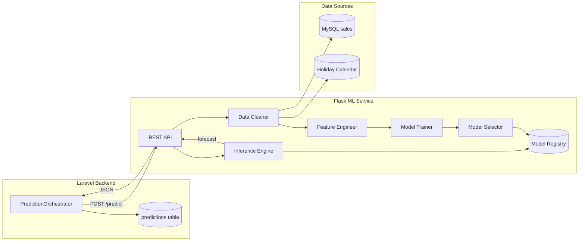

---

## 12. Security Architecture

### 12.1 Laravel Sanctum

Sanctum issues per-user bearer tokens stored as SHA-256 hashes in `personal_access_tokens`. Tokens are sent in the `Authorization: Bearer <token>` header. Tokens have abilities (scopes) and can be revoked. The SPA uses the token flow (not cookie-based session auth) to keep the API stateless and CORS-friendly.

### 12.2 RBAC (Role Based Access Control)

Three roles are defined: **Administrator**, **Manager**, **Cashier**. Permissions are granular per module (e.g., `products.create`, `sales.refund`). A custom middleware `role:slug` and a `Permission` enum enforce authorization at the route and controller levels. The `User.can(permission)` helper checks the user's role's permissions.

### 12.3 Password Hashing

Passwords are hashed with **bcrypt** (cost factor 10) via Laravel's `Hash::make()`. Plaintext passwords are never stored or logged. Password reset tokens are time-limited (60 minutes) and single-use.

### 12.4 CSRF

For the SPA, Sanctum's token-based flow is used (not cookie-based), so traditional CSRF is not applicable. For any cookie-based admin routes, Laravel's `VerifyCsrfToken` middleware enforces CSRF tokens on state-changing requests.

### 12.5 SQL Injection Prevention

All database access uses **Eloquent ORM** with parameter binding. Raw queries, when unavoidable, use PDO prepared statements with bound parameters. User input is never concatenated into SQL.

### 12.6 XSS Protection

- React escapes all interpolated values by default (JSX binding is HTML-safe).
- Laravel API Resources serialize data as JSON; no HTML is rendered server-side.
- A strict **Content Security Policy** header is set on the Nginx layer.
- `htmlspecialchars` is applied on any server-rendered content.

### 12.7 Audit Logs

Every state-changing operation is logged via the `AuditService` to `audit_logs`. The log captures: user, action, module, entity type/id, old and new values (JSON diff), IP address, user agent, and timestamp. Logs are append-only and retained for 12 months.

### 12.8 Rate Limiting

Laravel's `throttle` middleware is applied to:

- `/auth/login` — 5 attempts per minute per IP (brute-force protection).
- `/predictions/train` — 1 per hour per user.
- All API routes — 60 requests per minute per token.

Exceeding the limit returns `429 Too Many Requests` with a `Retry-After` header.

---

## 13. Design Patterns

### 13.1 MVC (Model-View-Controller)

Laravel's native MVC is the architectural backbone. Models (Eloquent) represent domain entities, Controllers handle HTTP, and API Resources act as the view layer (JSON serialization). React serves as the client-side view.

### 13.2 Repository Pattern

Each entity has a Repository interface (e.g., `ProductRepositoryInterface`) and an Eloquent implementation. Services depend on interfaces, enabling swapping the persistence layer (e.g., to a read replica) without touching business logic.

### 13.3 Service Layer

Business logic is encapsulated in service classes (`BillingService`, `InventoryService`, `PredictionOrchestrator`). Controllers remain thin; services are reusable and testable.

### 13.4 Dependency Injection

Laravel's service container resolves interfaces to concrete implementations. Services declare their dependencies in constructors; the container auto-wires them. This enables easy mocking in tests.

### 13.5 Factory Pattern

- **Domain factories** — Eloquent factories generate test data for unit tests.
- **PaymentFactory** — Resolves a payment strategy (`CashPayment`, `CardPayment`, `MobilePayment`) based on the `payment_method` enum.

### 13.6 Singleton

The `AuditService` and `PredictionOrchestrator` are registered as singletons in the service container — a single instance is shared across the request lifecycle, ensuring consistent audit context and avoiding redundant model loads.

### 13.7 Observer

Eloquent observers react to lifecycle events:

- `SaleObserver` — On `created`, dispatches `SaleCompleted` event and writes the audit log.
- `InventoryObserver` — On `updated`, checks reorder level and raises `StockLow` alert.
- `UserObserver` — On `created`, assigns default role and logs the action.

---

## 14. Scalability Design

### 14.1 Caching

- **Application cache** — Laravel's Redis-backed cache stores dashboard KPIs, product lists, and forecast results with TTLs (60s for KPIs, 24h for predictions).
- **HTTP cache** — `Cache-Control` headers on static assets served by Nginx.
- **Query cache** — MySQL query cache for read-heavy report endpoints.

### 14.2 Queue

Long-running tasks are dispatched to a Redis-backed queue workers:

- Prediction retraining jobs.
- Report generation (PDF/CSV export).
- Audit log batching.
- Low-stock email notifications.

This keeps the API responsive under load.

### 14.3 Lazy Loading

- React uses `React.lazy` + `Suspense` for code-splitting per module route.
- API endpoints support cursor-based pagination to avoid loading large result sets.
- Eloquent uses lazy loading of relationships selectively; eager loading is applied where N+1 queries would otherwise occur.

### 14.4 Database Indexing

High-frequency columns are indexed (see Section 5.3). Composite indexes are used for common filter+sort combinations (e.g., `(sale_date, product_id)` on `sale_items`).

### 14.5 Pagination

All list endpoints enforce pagination (default 25, max 100). Cursor pagination is preferred over offset pagination for large tables to maintain performance on deep pages.

### 14.6 API Optimization

- **Eager loading** of relationships to prevent N+1.
- **Field selection** (`select`) to reduce payload size.
- **API Resources** to control the JSON shape and avoid leaking internal fields.
- **Gzip compression** enabled at the Nginx layer.
- **HTTP/2** for multiplexed requests.

---

## 15. Non Functional Architecture

### 15.1 Performance

- API response target: < 200ms (p95) for read endpoints.
- Billing transaction target: < 500ms including inventory deduction.
- Prediction request target: < 2s for cached, < 10s for fresh inference.
- Frontend LCP target: < 2.5s on a 4G connection.

### 15.2 Security

- All traffic over TLS 1.3.
- Bcrypt password hashing (cost 10).
- Sanctum token rotation on logout.
- Rate limiting on auth and training endpoints.
- Audit logging of all mutations.
- Input validation on every Form Request.

### 15.3 Reliability

- Database transactions for multi-step mutations (sale + inventory + audit).
- Idempotency keys on sale creation to prevent double-submit duplicates.
- Retry with exponential backoff on Flask API failures.
- Circuit breaker on the PredictionOrchestrator to fail gracefully if the ML service is down (returns last cached forecast).

### 15.4 Availability

- Stateless API enables horizontal scaling behind a load balancer.
- MySQL primary/replica replication for read scaling and failover.
- Flask service deployed with multiple gunicorn workers.
- Health-check endpoints (`/health`) for liveness probes.

### 15.5 Maintainability

- Layered architecture with strict boundaries.
- Repository and Service patterns isolate change.
- Versioned migrations.
- PSR-12 code style; PHPStan static analysis.
- OpenAPI/Swagger documentation auto-generated from controllers.

### 15.6 Scalability

- Stateless API tier scales horizontally.
- Queue workers scale independently.
- ML service scales independently of the POS backend.
- Read replicas offload reporting queries from the primary.

---

## 16. Technology Justification

### 16.1 Laravel 12

Laravel provides a mature MVC framework with built-in support for Sanctum authentication, Eloquent ORM, queues, caching, and migrations. Its expressive syntax and strong ecosystem (Horizon, Telescope, Pint) accelerate development while enforcing clean architecture. For a POS backend requiring rapid CRUD, transactions, and RBAC, Laravel is the most productive choice in the PHP ecosystem.

### 16.2 React.js + Vite

React's component model maps naturally to a modular POS UI (Billing, Inventory, Reports as independent feature folders). Vite provides near-instant HMR and optimized production builds through esbuild and Rollup. React's unidirectional data flow and hooks model make complex state (cart, coupons, payments) predictable and testable.

### 16.3 MySQL 8.0

MySQL is a proven OLTP database with strong transactional guarantees, referential integrity, and broad hosting support in Sri Lanka. InnoDB's row-level locking suits the high-concurrency billing workload. JSON column support (used in `audit_logs`) and window functions (used in reports) reduce the need for additional infrastructure.

### 16.4 Python (Pandas, NumPy)

Python is the de facto language of data science. Pandas provides high-performance time-series manipulation, and NumPy underpins the numerical operations required by both Prophet and XGBoost. No other language offers comparable library depth for the ML workload.

### 16.5 Prophet

Prophet is designed for business time series with multiple seasonality patterns, holiday effects, and missing data — all characteristics of restaurant and retail sales in Sri Lanka, where weekly seasonality (weekend peaks) and festival-driven spikes (Vesak, Diwali) are pronounced. Prophet requires minimal tuning and provides interpretable components (trend, seasonality, holidays).

### 16.6 XGBoost

XGBoost is a state-of-the-art gradient-boosted tree library that excels at tabular data with engineered features. It captures non-linear interactions between calendar features, lag features, and rolling statistics that Prophet's additive model may miss. Its use of lag and rolling features makes it complementary to Prophet, and comparing both via RMSE/MAE provides a robust model-selection mechanism.

### 16.7 Flask

Flask is a lightweight WSGI framework ideal for exposing a single-purpose ML inference API. Its minimalism keeps the prediction service focused on data ingestion, model loading, and JSON response — without the overhead of a full web framework. Running behind gunicorn with multiple workers provides production-grade concurrency.

---

## 17. Module Interaction

The 19 modules interact through well-defined service boundaries:

- **Auth → User Management → Role & Permission** — Authentication produces a user; authorization consults roles and permissions on every request.
- **Dashboard → Billing, Reports, Analytics** — The Dashboard aggregates KPIs from Billing (today's sales), Reports (inventory status), and Analytics (trends).
- **Billing ↔ Product, Discount, Coupon, Customer, Inventory, Sales, Audit** — Billing is the central transactional module. It reads Product prices, applies active Discounts, validates Coupons, attaches a Customer, deducts Inventory, persists the Sale, and writes an Audit log — all within a single database transaction.
- **Product → Category, Brand, Supplier, Inventory** — A Product belongs to a Category and Brand and may have a Supplier. Each Product has one Inventory record.
- **Purchase → Supplier, Product, Inventory** — A Purchase is raised against a Supplier, contains Purchase Items referencing Products, and on receipt increments Inventory.
- **Sales → Customer, Inventory, Audit** — Sales records link to Customers, decrement Inventory, and emit audit events.
- **Expense → User, Reports** — Expenses are recorded by Users and feed into the Profit and Expense Reports.
- **Discount / Coupon → Billing** — Discounts and Coupons are evaluated by the BillingService at checkout.
- **User Management → Role & Permission → Audit** — User changes are authorized by RBAC and logged by Audit.
- **Audit Log ← all modules** — Every state-changing operation in every module writes to the Audit Log.
- **Reports → Sales, Inventory, Expense, Prediction** — Reports aggregate data from these modules.
- **Sales Prediction → Sales, Analytics Dashboard** — The Prediction module reads historical Sales, writes forecasts to the `predictions` table, and surfaces results in the Analytics Dashboard.
- **Analytics Dashboard → Sales, Prediction, Reports** — The Analytics Dashboard visualizes trends and forecasts by querying Sales, Prediction, and Reports.

All inter-module communication is mediated by Service classes and events; no module directly accesses another module's repository, preserving loose coupling.

---

## 18. Data Flow

The complete data flow from user login to prediction generation:

1. **Login** — The user submits credentials; React sends `POST /api/v1/auth/login`. Laravel's AuthService verifies the bcrypt hash, issues a Sanctum token, and returns it with the user's role. React stores the token and includes it in subsequent requests.

2. **Authorization Context** — On every API call, the `role` middleware resolves the user's role and permissions, attaching them to the request for controller-level checks.

3. **Billing Transaction** — The Cashier scans products; React accumulates the cart. On checkout, `POST /api/v1/sales` is sent. The BillingService validates the coupon, applies active discounts, computes tax, opens a database transaction, inserts the sale and sale items, deducts inventory, increments the coupon's `used_count`, writes an audit log, and commits. The response includes the invoice and change amount.

4. **Inventory Update** — Triggered within the billing transaction. The InventoryService decrements `inventory.quantity` for each sold product. If the resulting quantity falls below `reorder_level`, a `StockLow` event is dispatched; a queued listener sends an alert to the Manager.

5. **Audit Logging** — The AuditService, invoked by the BillingService, writes a row to `audit_logs` capturing the user, action, module, entity, old/new values, IP, and user agent.

6. **Historical Sales Accumulation** — Over time, the `sales` and `sale_items` tables accumulate the historical dataset that feeds prediction.

7. **Prediction Request** — A Manager opens the Sales Prediction module and selects a horizon. React calls `GET /api/v1/predictions?horizon=weekly`. The PredictionOrchestrator checks the `predictions` cache; on a miss, it queries historical sales, calls `POST /predict` on the Flask service, receives the forecast JSON, caches it in `predictions`, and returns it to React.

8. **ML Inference** — The Flask service loads the best model for the horizon from disk, runs inference on the engineered feature set, and returns the forecast series with `yhat`, `yhat_lower`, `yhat_upper`, and the model's RMSE/MAE.

9. **Visualization** — React renders the forecast as a line chart with a confidence band, displays the selected model and its metrics, and allows the Manager to switch horizons.

10. **Reporting** — The Manager can export the forecast via `GET /reports/forecast`, which assembles a PDF/CSV using the cached predictions.

This end-to-end flow ensures that every transaction is atomic and audited, every prediction is reproducible and metric-backed, and every layer remains decoupled and independently testable.

---

## 19. Conclusion

The architecture presented in this chapter is purposefully engineered to satisfy the dual demands of a **transactional Point of Sale system** and a **data-driven sales prediction platform** within the operational context of Sri Lankan restaurants and retail shops.

The **layered modular monolith** (Laravel + React + MySQL) provides the strong transactional guarantees, referential integrity, and rapid CRUD performance required by high-volume billing, inventory, and purchase workflows. The strict separation of Presentation, Business, API, and Data layers — reinforced by the Repository and Service Layer patterns — ensures that the system remains maintainable and testable as functional scope grows across the nineteen modules.

The **dedicated Machine Learning microservice** (Python + Flask + Prophet + XGBoost) isolates the data-science workload from the transactional core, allowing the prediction pipeline to leverage the full Python ecosystem without coupling the PHP runtime to native numerical libraries. The dual-model approach — Prophet for seasonality and holidays, XGBoost for engineered tabular features — with selection based on RMSE and MAE, provides a robust, empirically validated forecasting mechanism that accommodates the weekly seasonality and festival-driven demand spikes characteristic of the Sri Lankan retail calendar.

The **security architecture** — Sanctum token authentication, RBAC authorization, bcrypt hashing, rate limiting, audit logging, and injection/XSS prevention — meets the integrity and accountability requirements of a financial-grade POS application. The **scalability design** — stateless API, queue workers, caching, indexing, and pagination — ensures the system can grow from a single outlet to a multi-branch deployment without architectural rework.

The **non-functional properties** — performance targets, reliability through transactions and idempotency, availability through horizontal scaling, and maintainability through layered patterns and versioned migrations — collectively ensure that the system is not only functional but production-grade.

In summary, this architecture is suitable for a Smart POS with Machine Learning because it cleanly separates the concerns of transactional processing and predictive analytics, employs industry-standard patterns and technologies, accommodates the seasonal and cultural demand patterns of Sri Lanka, and provides a clear path from a final-year research prototype to a deployable commercial product. The design therefore fulfils the research objectives and forms a sound foundation for the implementation, testing, and evaluation phases that follow in subsequent chapters.

---

**End of Chapter 5 — System Design**
