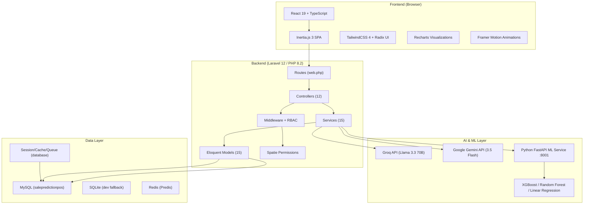
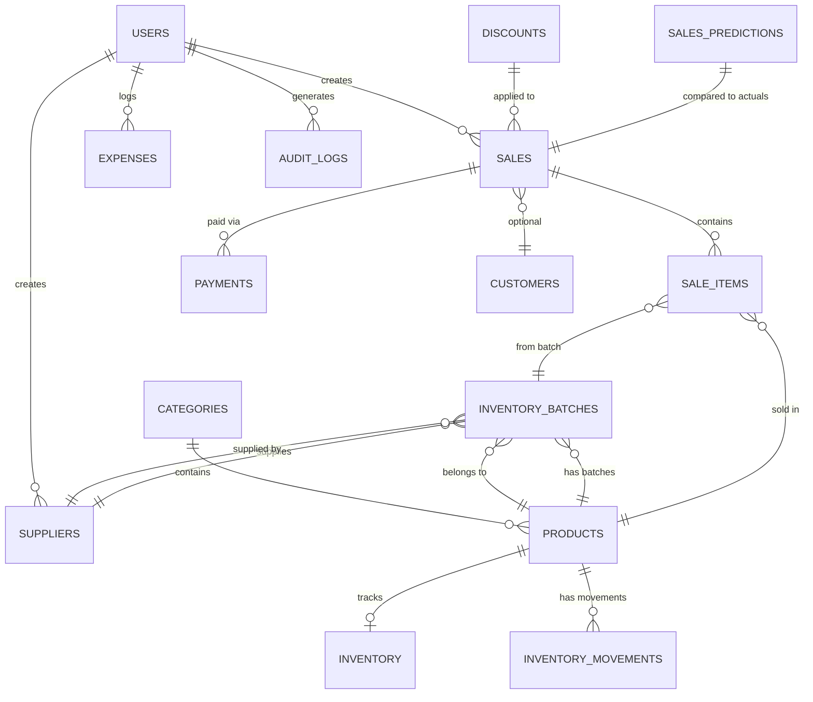
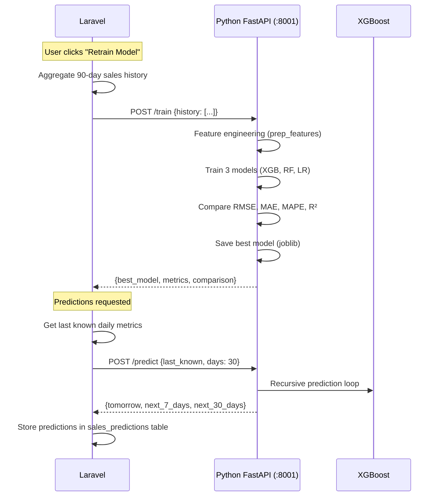
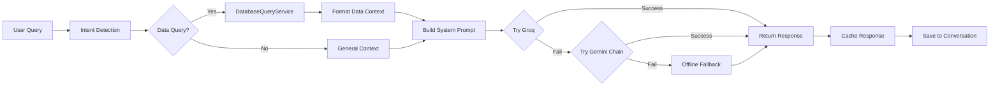
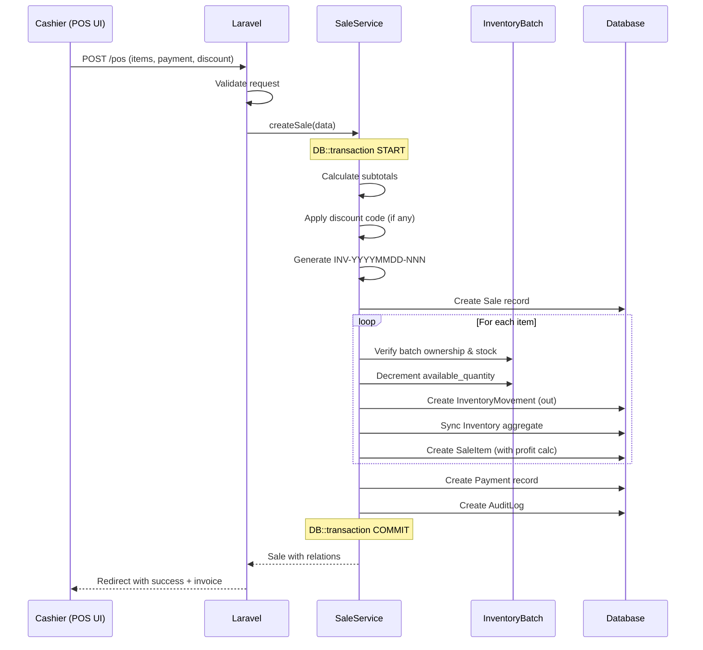

# 📋 SalesPredictionPos — Comprehensive System & Code Report

> **Project Name:** SalesPredictionPos  
> **Report Date:** 21 August 2026  
> **Author:** Automated Code Analysis  

---

## 1. Executive Summary

**SalesPredictionPos** is a full-stack, AI-powered Point-of-Sale (POS) and Sales Prediction system designed for **Sri Lankan SME retail businesses**. It combines a modern web-based POS terminal with machine learning–driven sales forecasting, an integrated AI chat assistant, and a comprehensive analytics & reporting suite.

The system is built on a **Laravel 12 + React 19 + Inertia.js 3** stack with a separate **Python FastAPI microservice** running XGBoost/Random Forest ML models for sales prediction. It supports **role-based access control (RBAC)** with 5 roles, **batch-level inventory tracking** with FEFO (First-Expiring-First-Out) logic, **supplier management**, and **dual-LLM AI assistant** integration (Groq Llama 3.3 + Google Gemini).

---

## 2. System Architecture



---

## 3. Technology Stack

### 3.1 Backend

| Technology | Version | Purpose |
|---|---|---|
| **PHP** | ^8.2 | Runtime language |
| **Laravel** | ^12.0 | MVC Framework |
| **Inertia.js (Laravel)** | ^3.0 | SPA bridge (server-driven) |
| **Spatie Laravel Permission** | * | RBAC (Roles & Permissions) |
| **Laravel Fortify** | ^1.37.2 | Authentication (Passkeys, 2FA) |
| **Predis** | ^3.5 | Redis client |
| **Laravel Wayfinder** | ^0.1.14 | Type-safe route generation |

### 3.2 Frontend

| Technology | Version | Purpose |
|---|---|---|
| **React** | ^19.2.0 | UI Framework |
| **TypeScript** | ^5.7.2 | Type safety |
| **TailwindCSS** | ^4.0.0 | Utility-first CSS |
| **Radix UI** | Multiple | Accessible UI primitives (dialog, dropdown, select, checkbox, etc.) |
| **Recharts** | ^3.9.2 | Data visualization & charts |
| **Framer Motion** | ^12.42.2 | Animations |
| **Lucide React** | ^0.475.0 | Icon library |
| **Sonner** | ^2.0.0 | Toast notifications |
| **Canvas Confetti** | ^1.9.4 | Sale success celebration effects |
| **Vite** | ^8.0.0 | Build tool & HMR |

### 3.3 Machine Learning Service

| Technology | Purpose |
|---|---|
| **Python 3 + FastAPI** | ML REST API service |
| **XGBoost** | Primary regression model |
| **scikit-learn** | RandomForest, LinearRegression, metrics |
| **pandas / numpy** | Data processing & feature engineering |
| **joblib** | Model serialization |
| **Uvicorn** | ASGI server (port 8001) |

### 3.4 AI Assistant

| Provider | Model | Purpose |
|---|---|---|
| **Groq** | `llama-3.3-70b-versatile` | Primary AI (ultra-fast inference) |
| **Google Gemini** | `gemini-3.5-flash` → `gemini-2.0-flash` → `gemini-2.0-flash-lite` → `gemma-4-26b-a4b-it` | Fallback chain (4 models) |
| **Offline Fallback** | Rule-based | Keyword-matching fallback when all APIs fail |

### 3.5 Infrastructure & DevOps

| Technology | Purpose |
|---|---|
| **Docker** | Containerized deployment (PHP 8.2 + Apache) |
| **MySQL** | Production database |
| **SQLite** | Development database (included) |
| **PHPStan / Larastan** | Static analysis |
| **PHPUnit** | Testing framework |
| **Laravel Pint** | Code style (PSR-12) |
| **ESLint + Prettier** | Frontend linting & formatting |
| **Concurrently** | Dev server orchestration |

---

## 4. Database Schema

### 4.1 Entity-Relationship Diagram



### 4.2 Tables Overview (23 Migrations)

| Table | Key Columns | Purpose |
|---|---|---|
| **users** | id, name, email, phone, password, is_active, 2FA fields | User accounts |
| **categories** | id, name, is_active | Product categories |
| **products** | id, name, sku, barcode, category_id, price, cost, image, has_expiry, is_active | Product catalog |
| **inventory** | id, product_id, quantity, low_stock_threshold | Aggregate stock tracker |
| **inventory_batches** | id, product_id, supplier_id, batch_number, purchase_price, selling_price, quantity_received, available_quantity, manufacture_date, expiry_date, purchase_date, status | Batch-level inventory with FEFO |
| **inventory_movements** | id, product_id, type (in/out), quantity, reference, notes, user_id | Stock movement audit trail |
| **suppliers** | id, supplier_code, company_name, contact_person, phone, email, address, city, district, bank details, credit_limit, payment_terms, status | Supplier management (soft deletes) |
| **customers** | id, name, phone, email, address | Customer directory |
| **sales** | id, invoice_number, customer_id, user_id, subtotal, discount_amount, tax_amount, total, payment_method, status, notes | Sales transactions |
| **sale_items** | id, sale_id, product_id, batch_id, quantity, unit_price, purchase_price, selling_price, discount, total, profit | Individual line items with profit tracking |
| **payments** | id, sale_id, method, amount | Payment records |
| **expenses** | id, user_id, category, description, amount, date | Business expense tracking |
| **discounts** | id, code, type (percentage/fixed), value, min_spend, used_count, max_uses, valid_from, valid_until | Discount codes |
| **audit_logs** | id, user_id, action, auditable_type, auditable_id, old_values, new_values | Full audit trail |
| **sales_predictions** | id, prediction_date, predicted_amount, actual_amount, confidence, model_used, features, metrics | ML prediction storage |
| **permissions / roles** | Spatie permission tables | RBAC permission tables |
| **passkeys** | Fortify passkey tables | WebAuthn/Passkey authentication |
| **cache / jobs / sessions** | Laravel standard tables | Framework infrastructure |

---

## 5. Eloquent Models (15 Models)

| Model | File | Key Relationships |
|---|---|---|
| [User](file:///d:/SalePredictionPos/salesPredictionPos/app/Models/User.php) | `HasRoles`, `TwoFactorAuthenticatable`, `PasskeyAuthenticatable` | → Sales, Expenses, AuditLogs, Suppliers |
| [Product](file:///d:/SalePredictionPos/salesPredictionPos/app/Models/Product.php) | Core catalog entity | → Category, Inventory, Batches, InventoryMovements, SaleItems |
| [Sale](file:///d:/SalePredictionPos/salesPredictionPos/app/Models/Sale.php) | Transaction record | → Customer, User, Items, Payments |
| [SaleItem](file:///d:/SalePredictionPos/salesPredictionPos/app/Models/SaleItem.php) | Line item | → Sale, Product, Batch |
| [Inventory](file:///d:/SalePredictionPos/salesPredictionPos/app/Models/Inventory.php) | Aggregate stock cache | → Product |
| [InventoryBatch](file:///d:/SalePredictionPos/salesPredictionPos/app/Models/InventoryBatch.php) | Batch tracking with expiry | → Product, Supplier, Creator |
| [InventoryMovement](file:///d:/SalePredictionPos/salesPredictionPos/app/Models/InventoryMovement.php) | Stock audit trail | → Product, User |
| [Supplier](file:///d:/SalePredictionPos/salesPredictionPos/app/Models/Supplier.php) | Supplier entity (SoftDeletes) | → Batches, Creator |
| [Customer](file:///d:/SalePredictionPos/salesPredictionPos/app/Models/Customer.php) | Customer entity | → Sales |
| [Category](file:///d:/SalePredictionPos/salesPredictionPos/app/Models/Category.php) | Product category | → Products |
| [Expense](file:///d:/SalePredictionPos/salesPredictionPos/app/Models/Expense.php) | Business expense | → User |
| [Discount](file:///d:/SalePredictionPos/salesPredictionPos/app/Models/Discount.php) | Promo codes | Validation logic (`isValid()`) |
| [Payment](file:///d:/SalePredictionPos/salesPredictionPos/app/Models/Payment.php) | Payment record | → Sale |
| [AuditLog](file:///d:/SalePredictionPos/salesPredictionPos/app/Models/AuditLog.php) | Audit trail | → User |
| [SalesPrediction](file:///d:/SalePredictionPos/salesPredictionPos/app/Models/SalesPrediction.php) | ML predictions | — |

---

## 6. Role-Based Access Control (RBAC)

Implemented via **Spatie Laravel Permission** with 5 roles and 13 permissions:

| Role | Permissions | UI Access |
|---|---|---|
| **Super Admin** | All 13 permissions | Full system access |
| **Admin** | All 13 permissions | Full system access |
| **Manager** | view-dashboard, view-reports, view-forecast, manage-expenses, manage-customers, view-suppliers, manage-suppliers | Reports, Forecasts, Expenses, Suppliers |
| **Inventory Staff** | view-dashboard, manage-inventory, view-suppliers | Inventory management only |
| **Cashier** | view-dashboard, create-sale, manage-customers | POS terminal + Customers |

### Permission List
`create-sale`, `view-dashboard`, `manage-products`, `manage-inventory`, `manage-users`, `view-reports`, `view-forecast`, `manage-expenses`, `manage-discounts`, `manage-customers`, `view-audit-logs`, `view-suppliers`, `manage-suppliers`

> [!IMPORTANT]
> Every route is protected by both `auth` middleware and a specific `can:permission` gate. The AI Assistant also respects roles — it blocks queries for restricted features based on the user's role.

---

## 7. Routes & Controllers

### 7.1 Route Map (35+ Routes)

| Route Group | Controller | Routes | Middleware |
|---|---|---|---|
| **Dashboard** | [DashboardController](file:///d:/SalePredictionPos/salesPredictionPos/app/Http/Controllers/DashboardController.php) | `GET /dashboard` | `can:view-dashboard` |
| **POS Terminal** | [PosController](file:///d:/SalePredictionPos/salesPredictionPos/app/Http/Controllers/PosController.php) | `GET /pos`, `POST /pos`, `POST /pos/hold`, `POST /pos/{sale}/void` | `can:create-sale` |
| **Products** | [ProductController](file:///d:/SalePredictionPos/salesPredictionPos/app/Http/Controllers/ProductController.php) | Full resource (index/create/store/show/edit/update/destroy) | `can:manage-products` |
| **Inventory** | [InventoryController](file:///d:/SalePredictionPos/salesPredictionPos/app/Http/Controllers/InventoryController.php) | `GET /inventory`, `GET /inventory/movements`, `POST /inventory/adjust`, `PUT /inventory/batches/{batch}` | `can:manage-inventory` |
| **Customers** | [CustomerController](file:///d:/SalePredictionPos/salesPredictionPos/app/Http/Controllers/CustomerController.php) | Full resource | `can:manage-customers` |
| **Expenses** | [ExpenseController](file:///d:/SalePredictionPos/salesPredictionPos/app/Http/Controllers/ExpenseController.php) | Full resource | `can:manage-expenses` |
| **Suppliers** | [SupplierController](file:///d:/SalePredictionPos/salesPredictionPos/app/Http/Controllers/SupplierController.php) | CRUD + dropdown + stats | `can:view-suppliers` / `can:manage-suppliers` |
| **Reports** | [ReportController](file:///d:/SalePredictionPos/salesPredictionPos/app/Http/Controllers/ReportController.php) | 9 report endpoints (daily, product, category, customer, payment, inventory, profit, expiry, invoice) | `can:view-reports` |
| **Forecasts** | [ForecastController](file:///d:/SalePredictionPos/salesPredictionPos/app/Http/Controllers/ForecastController.php) | `GET /forecasts`, `POST /forecasts/retrain` | `can:view-forecast` |
| **Users** | [UserController](file:///d:/SalePredictionPos/salesPredictionPos/app/Http/Controllers/UserController.php) | Resource (except show, destroy) | `can:manage-users` |
| **AI Assistant** | [AIController](file:///d:/SalePredictionPos/salesPredictionPos/app/Http/Controllers/AIController.php) | `POST /ai/chat`, `GET /ai/history`, `POST /ai/clear`, `GET /ai-assistant` | `auth` |

---

## 8. Service Layer (15 Services)

The application follows a **Service-oriented architecture** pattern where controllers delegate business logic to dedicated service classes:

| Service | File | Responsibility |
|---|---|---|
| [SaleService](file:///d:/SalePredictionPos/salesPredictionPos/app/Services/SaleService.php) | Sale lifecycle (create, hold, void) with DB transactions, batch deduction, audit logging |
| [InventoryService](file:///d:/SalePredictionPos/salesPredictionPos/app/Services/InventoryService.php) | Stock add/adjust/restore, batch creation, inventory sync |
| [DashboardService](file:///d:/SalePredictionPos/salesPredictionPos/app/Services/DashboardService.php) | KPI aggregation, sales trends, top products, category distribution |
| [PredictionService](file:///d:/SalePredictionPos/salesPredictionPos/app/Services/PredictionService.php) | Laravel ↔ Python ML bridge (train + predict), historical actual updates |
| [ExpiryService](file:///d:/SalePredictionPos/salesPredictionPos/app/Services/ExpiryService.php) | Expiry alerts (expired, today, 3d, 7d, 30d), batch reports, write-off |
| [AIService](file:///d:/SalePredictionPos/salesPredictionPos/app/Services/AIService.php) | AI orchestrator: intent detection → DB query → LLM dispatch → caching → fallback |
| [AIAssistantService](file:///d:/SalePredictionPos/salesPredictionPos/app/Services/AIAssistantService.php) | Intent classification, database query execution, data context formatting |
| [DatabaseQueryService](file:///d:/SalePredictionPos/salesPredictionPos/app/Services/DatabaseQueryService.php) | Read-only query layer for AI (628 lines, products/sales/inventory/expenses) |
| [GeminiService](file:///d:/SalePredictionPos/salesPredictionPos/app/Services/GeminiService.php) | Google Gemini API client with 4-model fallback chain, native cURL, IPv4 forced |
| [GroqService](file:///d:/SalePredictionPos/salesPredictionPos/app/Services/GroqService.php) | Groq API client (OpenAI-compatible), Llama 3.3 70B |
| [ContextBuilder](file:///d:/SalePredictionPos/salesPredictionPos/app/Services/ContextBuilder.php) | Constructs role-aware context for AI prompts |
| [PromptBuilder](file:///d:/SalePredictionPos/salesPredictionPos/app/Services/PromptBuilder.php) | System prompt construction with live data context |
| [ConversationManager](file:///d:/SalePredictionPos/salesPredictionPos/app/Services/ConversationManager.php) | Session-based chat history management |
| [RecommendationService](file:///d:/SalePredictionPos/salesPredictionPos/app/Services/RecommendationService.php) | AI-driven restock recommendations |
| [AuditService](file:///d:/SalePredictionPos/salesPredictionPos/app/Services/AuditService.php) | Centralized audit logging |

---

## 9. Frontend Architecture

### 9.1 Page Structure (14+ Pages)

| Page | File | Description |
|---|---|---|
| **Dashboard** | [dashboard.tsx](file:///d:/SalePredictionPos/salesPredictionPos/resources/js/pages/dashboard.tsx) (20KB) | KPI cards, sales trend chart, top products, category pie chart, predictions |
| **Smart POS** | [pos.tsx](file:///d:/SalePredictionPos/salesPredictionPos/resources/js/pages/pos.tsx) (58KB) | Full POS terminal with product grid, cart, batch selection, payment |
| **AI Assistant** | [ai-assistant.tsx](file:///d:/SalePredictionPos/salesPredictionPos/resources/js/pages/ai-assistant.tsx) (14KB) | Full-page AI chat interface |
| **Welcome** | [welcome.tsx](file:///d:/SalePredictionPos/salesPredictionPos/resources/js/pages/welcome.tsx) (42KB) | Landing/marketing page |
| **Forecasts** | [forecasts/index.tsx](file:///d:/SalePredictionPos/salesPredictionPos/resources/js/pages/forecasts/index.tsx) (18KB) | ML prediction dashboard, model metrics, accuracy charts |
| **Reports Hub** | [reports/index.tsx](file:///d:/SalePredictionPos/salesPredictionPos/resources/js/pages/reports/index.tsx) (22KB) | Analytics dashboard overview |
| **Daily Sales** | [reports/daily-sales.tsx](file:///d:/SalePredictionPos/salesPredictionPos/resources/js/pages/reports/daily-sales.tsx) (27KB) | Date-range daily revenue analysis |
| **Product Sales** | [reports/product-sales.tsx](file:///d:/SalePredictionPos/salesPredictionPos/resources/js/pages/reports/product-sales.tsx) (18KB) | Per-product performance |
| **Category Sales** | [reports/category-sales.tsx](file:///d:/SalePredictionPos/salesPredictionPos/resources/js/pages/reports/category-sales.tsx) (11KB) | Category breakdown |
| **Profit Report** | [reports/profit-sales.tsx](file:///d:/SalePredictionPos/salesPredictionPos/resources/js/pages/reports/profit-sales.tsx) (9KB) | Margin analysis |
| **Expiry Report** | [reports/expiry-report.tsx](file:///d:/SalePredictionPos/salesPredictionPos/resources/js/pages/reports/expiry-report.tsx) (13KB) | Expired/expiring stock alerts |
| **Customer Sales** | [reports/customer-sales.tsx](file:///d:/SalePredictionPos/salesPredictionPos/resources/js/pages/reports/customer-sales.tsx) (6KB) | Per-customer analysis |
| **Payment Sales** | [reports/payment-sales.tsx](file:///d:/SalePredictionPos/salesPredictionPos/resources/js/pages/reports/payment-sales.tsx) (8KB) | Payment method breakdown |
| **Inventory Sales** | [reports/inventory-sales.tsx](file:///d:/SalePredictionPos/salesPredictionPos/resources/js/pages/reports/inventory-sales.tsx) (8KB) | Stock valuation |

### 9.2 Component Library (27 UI + 30 App Components)

**Base UI Components** (Radix-based, in `components/ui/`):
`alert`, `avatar`, `badge`, `breadcrumb`, `button`, `card`, `checkbox`, `collapsible`, `dialog`, `dropdown-menu`, `empty-state`, `icon`, `input`, `input-otp`, `label`, `navigation-menu`, `placeholder-pattern`, `select`, `separator`, `sheet`, `sidebar`, `skeleton`, `sonner`, `spinner`, `toggle`, `toggle-group`, `tooltip`

**Application Components** (in `components/`):
`ai-assistant-floating`, `app-header`, `app-sidebar`, `app-logo`, `nav-main`, `nav-footer`, `nav-user`, `breadcrumbs`, `manage-passkeys`, `manage-two-factor`, `two-factor-setup-modal`, `two-factor-recovery-codes`, `passkey-register`, `passkey-verify`, `passkey-item`, `password-input`, `user-info`, `user-menu-content`, `delete-user`, `error-pages`, `heading`, and more.

### 9.3 Layouts

| Layout | File | Usage |
|---|---|---|
| [AppLayout](file:///d:/SalePredictionPos/salesPredictionPos/resources/js/layouts/app-layout.tsx) | Authenticated app shell with sidebar | Dashboard, POS, Reports, etc. |
| [AuthLayout](file:///d:/SalePredictionPos/salesPredictionPos/resources/js/layouts/auth-layout.tsx) | Authentication pages | Login, Register, Forgot Password |

---

## 10. Machine Learning Pipeline

### 10.1 Architecture



### 10.2 Feature Engineering

| Feature | Type | Description |
|---|---|---|
| `day_of_week` | Temporal | 0-6 (Monday–Sunday) |
| `month` | Temporal | 1-12 |
| `is_weekend` | Binary | Saturday/Sunday flag |
| `sales_last_1_day` | Lag | Previous day's total sales |
| `sales_last_7_days` | Rolling | 7-day moving average |
| `transactions` | Volume | Daily transaction count |
| `discount_amount` | Financial | Daily discount total |

### 10.3 Model Comparison

Three models are trained and compared on every retrain cycle:

| Model | Library | Hyperparameters |
|---|---|---|
| **XGBoost Regressor** | `xgboost` | n_estimators=100, learning_rate=0.05, max_depth=5 |
| **Random Forest** | `sklearn` | n_estimators=100, max_depth=6 |
| **Linear Regression** | `sklearn` | Default |

**Selection Criteria:** Model with lowest **MAPE** (Mean Absolute Percentage Error) is auto-selected.

### 10.4 Data Quality

- **Outlier handling:** IQR-based capping (clips instead of dropping to preserve time continuity)
- **Missing values:** Forward/backward fill + zero fill
- **Minimum data:** 10 days required for training, 80/20 train/test split (no shuffle for time series)
- **Prediction:** Recursive multi-step forecasting with decaying confidence scores (95% → -0.4% per day)

### 10.5 FastAPI Endpoints

| Endpoint | Method | Purpose |
|---|---|---|
| `GET /` | Info | Service status & links |
| `GET /health` | Health | Health check |
| `GET /metrics` | Metrics | Trained model performance |
| `POST /train` | Train | Train all 3 models, save best |
| `POST /predict` | Predict | Generate N-day recursive forecast |

---

## 11. AI Assistant Architecture

### 11.1 Processing Pipeline



### 11.2 LLM Fallback Chain

1. **Groq** (Llama 3.3 70B) — 15s timeout
2. **Gemini 3.5 Flash** — 8s timeout
3. **Gemini 2.0 Flash** — 8s timeout  
4. **Gemini 2.0 Flash Lite** — 8s timeout
5. **Gemma 4 26B** — 25s timeout
6. **Offline Rule-based Bot** — keyword matching fallback

### 11.3 Key Features

- **Role-aware responses**: Restricts data access based on user's RBAC role
- **Live database querying**: AI can search products, sales, inventory, expenses in real-time
- **Caching**: 2-min cache for data queries, 5-min for general queries
- **Session-based memory**: Conversation history persisted in PHP session
- **628-line DatabaseQueryService**: Comprehensive read-only query layer for safe AI data access

---

## 12. Core Business Features

### 12.1 POS Terminal
- Product catalog grid with category filtering
- **Batch-based stock selection** (FEFO — First Expiring First Out)
- Cart management with per-item discounts
- Discount code application (percentage/fixed with min_spend)
- 3 payment methods: Cash, Card, Digital
- **Hold/Resume** orders functionality
- **Void** sales with automatic inventory restoration
- Unique invoice generation: `INV-YYYYMMDD-001`
- Real-time stock deduction with batch-level tracking
- Per-item profit calculation at point of sale
- **Audit logging** for every sale event

### 12.2 Inventory Management
- **Batch-level tracking** with supplier, purchase price, selling price
- **Expiry date management** with multi-tier alerts (today, 3d, 7d, 30d)
- **FEFO dispensing logic** — oldest-expiring items sold first
- Stock adjustments (add/remove with movement logging)
- Auto-generated batch numbers: `BAT-{SKU}-{SEQ}`
- Low stock threshold alerts
- Aggregate inventory cache sync after every transaction
- Full movement audit trail

### 12.3 Supplier Management
- Auto-generated supplier codes: `SUP0001`
- Comprehensive contact/banking details
- Credit limit & balance tracking
- Payment terms management
- Soft deletes for data integrity
- Linked to inventory batches

### 12.4 Reporting Suite (9 Reports)

| Report | Metrics |
|---|---|
| **Analytics Hub** | Today/Yesterday/Weekly/Monthly/Yearly sales, orders, AOV, profit, top products, categories, hourly heatmap |
| **Daily Sales** | Date-range revenue with charts |
| **Product Sales** | Per-SKU revenue, quantity, margins |
| **Category Sales** | Department-level performance |
| **Customer Sales** | Per-customer spending analysis |
| **Payment Sales** | Cash/Card/Digital breakdown |
| **Inventory Sales** | Stock valuation, movement analysis |
| **Profit Report** | Gross/net margins, expense deduction |
| **Expiry Report** | Expired/expiring batches with filter levels |

### 12.5 User & Authentication
- Email/password authentication (Fortify)
- **Passkey/WebAuthn** support
- **Two-Factor Authentication** (TOTP with QR codes)
- Recovery codes
- Profile management (name, email, password, phone)
- User activation/deactivation

---

## 13. Security Analysis

### 13.1 Strengths

| Area | Implementation |
|---|---|
| **Authentication** | Laravel Fortify + 2FA + Passkeys |
| **Authorization** | Spatie RBAC on every route (`can:` middleware) |
| **CSRF Protection** | Inertia.js built-in CSRF token handling |
| **SQL Injection** | Eloquent ORM parameterized queries throughout |
| **Input Validation** | Server-side validation in every controller action |
| **Password Hashing** | bcrypt (12 rounds) |
| **Audit Trail** | Full audit logging via AuditService |
| **DB Transactions** | All sales/inventory operations wrapped in `DB::transaction()` |
| **Soft Deletes** | Suppliers use SoftDeletes to preserve data integrity |

### 13.2 Concerns

> [!WARNING]
> **API Keys in `.env`**: The `.env` file contains plaintext `GEMINI_API_KEY` and `GROQ_API_KEY`. Ensure `.env` is **never committed to version control**.

> [!WARNING]
> **SSL Verification Disabled**: Both `GeminiService` and `GroqService` use `CURLOPT_SSL_VERIFYPEER => false`. This should be set to `true` in production.

> [!CAUTION]
> **Empty DB Password**: The `.env` has `DB_PASSWORD=` (empty). Use a strong password in production.

> [!NOTE]
> **Session Encryption**: `SESSION_ENCRYPT=false` — consider enabling in production for additional security.

---

## 14. Code Quality & Patterns

### 14.1 Architecture Patterns Used

| Pattern | Usage |
|---|---|
| **Service Layer** | Controllers delegate to 15 service classes |
| **Repository-like Services** | DatabaseQueryService acts as a read-only data access layer |
| **Strategy Pattern** | ML model selection (best MAPE wins) |
| **Chain of Responsibility** | LLM fallback chain (Groq → Gemini × 3 → Gemma → Offline) |
| **Builder Pattern** | ContextBuilder, PromptBuilder for AI prompts |
| **Observer/Hook** | Supplier model boot hook for auto-generating codes |
| **Façade** | Laravel facades (Auth, DB, Log, Cache, Http) |
| **Dependency Injection** | Constructor injection throughout controllers and services |

### 14.2 Code Statistics

| Metric | Count |
|---|---|
| **Eloquent Models** | 15 |
| **Controllers** | 12 (+ Settings controllers) |
| **Services** | 15 |
| **Database Migrations** | 23 |
| **Frontend Pages** | 14+ (TSX) |
| **UI Components** | 27 (Radix-based) |
| **App Components** | 29 |
| **Routes** | 35+ |
| **Permissions** | 13 |
| **Roles** | 5 |
| **Report Endpoints** | 9 |
| **ML Models** | 3 (XGBoost, RF, LR) |
| **AI LLM Models** | 6 (with fallback chain) |

### 14.3 Code Quality Tools

| Tool | Configuration |
|---|---|
| **PHPStan / Larastan** | [phpstan.neon](file:///d:/SalePredictionPos/salesPredictionPos/phpstan.neon) |
| **Laravel Pint** | [pint.json](file:///d:/SalePredictionPos/salesPredictionPos/pint.json) (PSR-12) |
| **ESLint** | [eslint.config.js](file:///d:/SalePredictionPos/salesPredictionPos/eslint.config.js) |
| **Prettier** | [.prettierrc](file:///d:/SalePredictionPos/salesPredictionPos/.prettierrc) |
| **TypeScript** | [tsconfig.json](file:///d:/SalePredictionPos/salesPredictionPos/tsconfig.json) (strict mode) |
| **PHPUnit** | [phpunit.xml](file:///d:/SalePredictionPos/salesPredictionPos/phpunit.xml) |

---

## 15. Deployment

### 15.1 Docker Configuration

The [Dockerfile](file:///d:/SalePredictionPos/salesPredictionPos/Dockerfile) provides a single-container deployment:

```
PHP 8.2 + Apache → Composer Install → NPM Build → pip install → Migrations → Serve
```

- **Base Image:** `php:8.2-apache`
- **PHP Extensions:** pdo_mysql, mbstring, exif, pcntl, bcmath, gd
- **Node.js / npm:** Installed for frontend build
- **Python 3 + pip:** Installed for ML requirements
- **Apache:** Rewrite module enabled, DocumentRoot set to `/public`
- **Auto-migration:** Runs `php artisan migrate --force` on container start
- **Port:** 80

### 15.2 Development Setup

```bash
# Dev server (runs all 3 services concurrently)
composer dev
# This starts:
#   1. php artisan serve       (Laravel :8000)
#   2. php artisan queue:listen (Queue worker)
#   3. npm run dev             (Vite HMR :5173)

# ML Service (separate terminal)
cd ml-service && python main.py  # FastAPI :8001
```

---

## 16. Data Flow Summary

### 16.1 Sale Transaction Flow



---

## 17. File Structure Overview

```
SalePredictionPos/
├── Dockerfile (root - multi-service container)
├── .dockerignore
└── salesPredictionPos/
    ├── app/
    │   ├── Actions/Fortify/           # Fortify auth actions
    │   ├── Concerns/                  # Shared validation rules
    │   ├── Console/                   # Artisan commands
    │   ├── Http/
    │   │   ├── Controllers/           # 12 controllers + Settings
    │   │   ├── Middleware/            # HandleAppearance, HandleInertiaRequests
    │   │   └── Requests/             # Form request classes
    │   ├── Models/                    # 15 Eloquent models
    │   ├── Providers/                 # AppServiceProvider, FortifyServiceProvider
    │   └── Services/                  # 15 service classes
    ├── config/                        # 13 config files
    ├── database/
    │   ├── migrations/                # 23 migration files
    │   ├── seeders/                   # DatabaseSeeder, DemoDataSeeder, RolePermissionSeeder
    │   └── database.sqlite            # Dev SQLite DB
    ├── ml-service/                    # Python ML microservice
    │   ├── main.py                    # FastAPI app
    │   ├── model.py                   # ML training & prediction
    │   ├── sales_xgb_model.joblib     # Serialized model
    │   ├── model_metrics.joblib       # Model metrics
    │   └── requirements.txt           # Python dependencies
    ├── resources/
    │   ├── css/                       # TailwindCSS entry
    │   ├── js/
    │   │   ├── pages/                 # 14+ page components
    │   │   ├── components/            # 29 app + 27 UI components
    │   │   ├── layouts/               # App + Auth layouts
    │   │   ├── hooks/                 # Custom React hooks
    │   │   ├── lib/                   # Utility functions
    │   │   ├── types/                 # TypeScript definitions
    │   │   └── app.tsx                # App entry point
    │   └── views/                     # Blade templates
    ├── routes/
    │   ├── web.php                    # 35+ web routes
    │   ├── settings.php               # Settings routes
    │   └── console.php                # Console routes
    ├── tests/                         # Feature + Unit tests
    ├── composer.json                  # PHP dependencies
    ├── package.json                   # Node dependencies
    ├── vite.config.ts                 # Vite + React + Tailwind config
    ├── Dockerfile                     # App container
    └── .env                           # Environment configuration
```

---

## 18. Summary of Key Strengths

| Strength | Details |
|---|---|
| 🏗️ **Clean Architecture** | Service layer pattern with clear separation of concerns |
| 🔒 **Strong RBAC** | 5 roles, 13 permissions, middleware on every route |
| 🤖 **Dual AI Integration** | Groq + Gemini with 6-level fallback chain |
| 📊 **ML-Powered Forecasting** | 3-model comparison with auto-selection by MAPE |
| 📦 **Batch Inventory** | FEFO logic, expiry tracking, supplier linkage |
| 🧾 **Complete POS** | Cart, hold/resume, void, discount codes, batch selection |
| 📈 **9 Report Types** | Comprehensive analytics with charting |
| 🔍 **Full Audit Trail** | Every sale/void/adjustment logged |
| 🐳 **Docker Ready** | Single-container deployment |
| 🔐 **Modern Auth** | 2FA, Passkeys, recovery codes |

---

## 19. Potential Improvements

> [!TIP]
> **Recommendations for production hardening and future enhancements:**

1. **Enable SSL verification** in GeminiService and GroqService (`CURLOPT_SSL_VERIFYPEER => true`)
2. **Set a strong MySQL password** and enable session encryption
3. **Add API rate limiting** on AI chat endpoints to prevent abuse
4. **Implement WebSocket** for real-time POS updates across terminals
5. **Add PDF export** for invoices and reports
6. **Expand test coverage** — Feature and Unit test directories exist but appear minimal
7. **Add scheduled commands** for auto-retraining ML models (e.g., nightly cron)
8. **Implement caching** for dashboard KPIs and reports (currently re-queries on every load)
9. **Add product image uploads** with cloud storage (S3/GCS)
10. **Multi-currency support** for international expansion beyond Sri Lanka

---

> **Report generated by comprehensive code analysis covering all 15 models, 12 controllers, 15 services, 23 migrations, 14+ frontend pages, and the Python ML microservice.**
